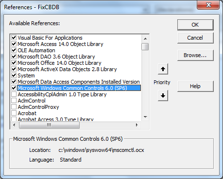
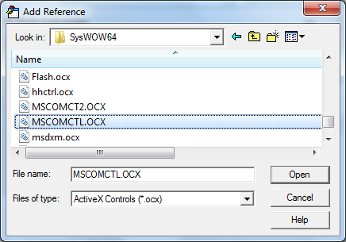

# Appendix B: Updating the Visual Basic Environment (if necessary)

## Adding References

CBDB uses a variety of Visual Basic resources that are not part of the default MS Access Visual
Basic environment. If your effort to run a routine produces an error about an undefined VB
object, you may need to double-check the “References” used by Visual Basic.
To do this:

1. Under “Database Tools” in the main Access window, select Visual Basic. This will launch
the Visual Basic editor.
2. In the VB editor, click on the menu item “Tools” and then “References…” You will see
something like:

    

3. If you do not see the same references checked, please scroll down the list and make your “References” list match this one. You may encounter a complaint about duplicated
resources. In that case, you will see that your initial checked list has components that are not on this list. Uncheck them and try again.

## Adding TreeView to Visual Basic

If your copy of Access gives you an error when you try to select an office in LookAtOffices or
select an association in LookAtAssociations, this is because you do not have a file
(MSCOMTL.ocx) added to your Visual Basic environment.

To Fix:

1. Under “Database Tools” in the main Access window, select Visual Basic. This will launch
the Visual Basic editor.
2. In the VB editor, click on the menu item “Tools” and then “References…” You will see
something like:

    

3. If you see “Microsoft Windows Common Controls 6.0 (SP6),” then your problem may
something else. Please uncheck the check box, close the window, exit the VB editor, close
Access, then reopen Access, return to the editor, and go to step 5 below. If this does not let
TreeView work, please let us know.
4. If you do NOT see the line, please scroll down the list. If you find the line, click on it to
check the box. Click OK.
5. If you do not find the Common Controls 6.0 on the list, you will need to add it.

    a. Click on “Browse…”
    b. If you are using Windows 7, go to the subdirectory SysWOW64 in the Windows
    directory.
    If you are using Windows XP, go to the subdirectory System32.
    c. Change the “Files of type” to: “ActiveX Controls (*.ocx)”
    d. You should see:

    

    e. Click on “MSCOMCTL.OCX”
    f. Click on “Open”
    g. Make sure the check-box for Common Controls 6.0 is checked in the References window, then click “OK.”

6. If you do not find MSCOMCTL.OCX in SysWOW64, you will need to add it.

    a. The CBDBPatch.rar file that you downloaded from the CBDB website contains a copy of the OCX file as well as these instructions.

    b. Copy the file MSCOMCTL.OCX to C:\WINDOWS\SysWOW64
    
    c. Now you will need to register the file:

        1. Click on the Windows “Start” Button.
        2. Select “All Programs” and then “Accessories”
        3. Right-click on “Command Prompt” and click on “Run as Administrator.”
        4. Click “yes” when the system asks you if it can proceed.
        5. In the Command Prompt window, type:
            REGSVR32 C:\Windows\sysWOW64\MSCOMCTL.OCX
        6. Hit “Enter” to run the program.
        7. Close the Command Prompt window.
    
    d. Now perform the steps listed in (1) - (5) on the first page.

7. To exit the Visual Basic Editor, click on the menu item “File” and then on “Close and
Return to Microsoft Access.”

