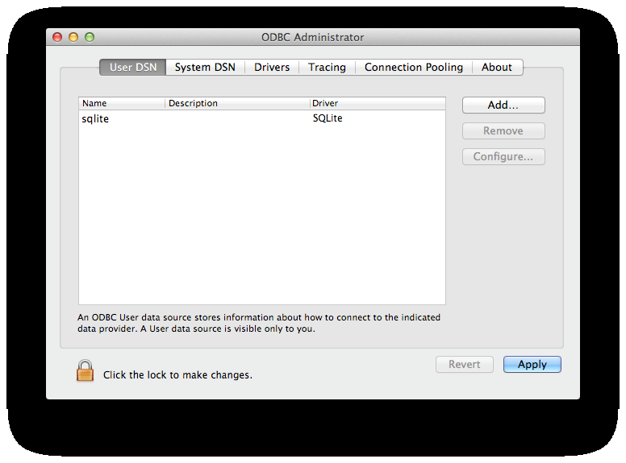
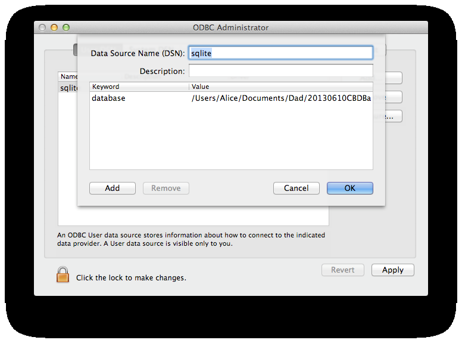

# Appendix C: Installing the SQLite CBDB database on a Macintosh

For Apple users (or Linux users, who probably do not need these instructions), there is a
stand-alone version of the CBDB database using the SQLite format.

For any database file to be used in a Macintosh system, the operating system needs a
connector between the file and the standard ODBC (Open Database Connectivity) interface.
In order to make this connection, you will need the Mac ODBC Administrator and the
ODBC driver for SQLite. (You may need to download these from the web, or you may
decide to leave these steps to your information technology specialist, if you have access to one. The ODBC driver for SQLite can be downloaded from http://www.ch-werner.de/sqliteodbc/ ).

1. Install the Macintosh ODBC Administrator and the driver for SQLite.
2. In “Finder,” go to Utilities and open the ODBC Administrator.
3. Go to User DSN and add “CBDBFull” as an SQLite database:

4. Click on “Configure” to set up the connector:

5. Add the keyword “database” and use the full path for the database file as the “value.”
6. Click on OK. The window will close. Then click on Apply.
7. The SQLite version of CBDB should be ready to use with OpenOffice or whatever
software interface you prefer.
