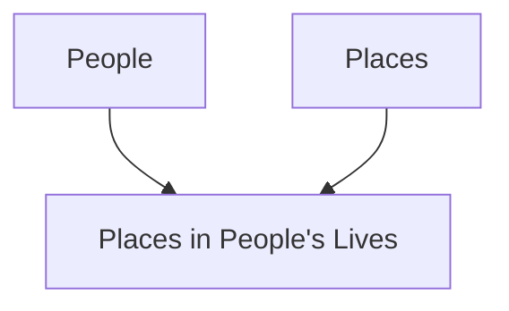
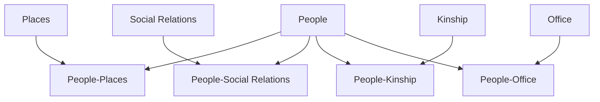

# Chapter 1. Relational Databases

## A. Relational Database and the Organization of Complex Data

The social historian Robert Hartwell (1932-1996), who was concerned with the
kinship and social networks of Song Dynasty officials, first conceived of using a
relational database to study collective biographies, and CBDB evolved out of his initial
model.
Hartwell’s important step was to see that he needed a powerful organizing tool
to meet the challenges of the project he proposed. He wanted to look at relations
between people, their kinship groups, their social networks, the offices they held, and
the places with which they were associated. This is a long list, and the interactions
between all of these elements grow complex and difficult to track. Hartwell realized
that he could think of the interactions he saw in biographical data as relations between
(1) people, (2) places, (3) a bureaucratic system, (4) kinship structures and (5)
contemporary modes of social association. He built a relational database precisely to
capture biographical data as the relations between these five “things.” In the current
version of CBDB that grew out of Hartwell’s model, we have added three more aspects
of social experience through which individuals defined themselves: (6) social
institutions like temples, academies, etc., (7) cultural systems for attaining social
distinction, and (8) the vast webs of textual production.
This structuring of relationships between entities, categories of “things” in the
world, is what a relational database does: it allows one to capture multiform relations
between complex objects that interact with one another. That is, PLACE is an entity,
and under this category we can list any and all places about which we have information
and in which we are interested. Similarly, under PEOPLE as yet another entity, we list
all the people about whom we have biographical information. Then we can list all the
interactions we care to record between people and places: where they were born,
where they moved, where they were buried, and so on. We have the abstract model of
relations between entities:

This abstract model, when transformed into a relational database, becomes a series of
tables filled with data divided into fields:

**PEOPLE**

| ID | Name                     | Dates        |
|----|--------------------------|-------------|
| 1  | Lü Benzhong 吕本中       | 1084–1145   |
| 2  | An Dun 安惇              | 1042–1101   |
| 3  | Chao Buzhi 晁补之        | 1053–1110   |
| 4  | Chen Jian (5) 陈荐       | fl. 1069    |

**PEOPLE PLACES**

| Person ID | Place ID | Relation Type ID |
|-----------|----------|------------------|
| 1         | 1        | 1                |
| 1         | 3        | 2                |
| 1         | 2        | 3                |

**PLACES**

| ID | Place Name        |
|----|------------------|
| 1  | Jinhua 金华      |
| 2  | Shouzhou 寿州    |
| 3  | Kaifeng 开封     |

**PEOPLE-PLACE TYPES**

| Relation Type ID | Relation Type       |
|------------------|--------------------|
| 1                | Basic Affiliation  |
| 2                | Moved to           |
| 3                | Ancestral address  |

Note that with this arrangement of tables, there is no limit to the number of people, the
number of places, or the number of types of relations between people and places.
From this example of how people and place relate to one another, we see that in
relational databases there are three basic types of tables:

1. Tables that describe the basic “entities.” (The yellow tables “People” and “Places”
above) In CBDB, these include people, places, kinship term, bureaucratic structures, and so
on. The fields in these tables capture the attributes of these entities that we want to know
about. For people, this would include their names, birth and death dates, gender, and the like.
For places (“addresses” in CBDB parlance) it would include names, the administrative levels
(county, prefecture, etc.), when they were created, and so on.

2. Tables that describe relations between basic entities. (The blue “People-Places”
table) In CBDB, these translate the relations between people and their social, physical, and
cultural environment into a structured format. The fields in these tables capture the features
of the relations that are considered important in describing the relationship. For instance,
when a person receives a posting to serve in a bureaucratic office, in addition to the basic
information of who the person was and what the office was, we also would like to know (1)
where the post was, (2) if the person in fact served, and (3) when he served. Other types of
entities, however, also have important and often complex relations with one another. For
PLACES, for example, it would include its superior or subordinate units, and the period of
validity of those relations. For OFFICES, a key relationship is where the office fits into the
administrative hierarchy at any particular time.

3. Tables that describe the types of relations between entities. (The pink “People-Place
types” table.) Sometimes, there can be many ways for two “things” to interact in the world,
and we need to be able to be more specific in recording the details of the interaction. In the
example above, people can have many different ways of being related to a place: it might be the
place at which they were formally registered, the place at which they actually lived, or the place
where they were buried. We can group these relations into categories to give them structure.

## B. Rules for Structuring Data in a Relational Database

In databases, we try to record any particular datum only once. In the example above,
the name Lü Benzhong 呂本中appears in only one record in CBDB, in his basic entry in the
table for PEOPLE entities (the table is called `BIOG_MAIN`). All other records that record
information about Lü Benzhong refer to him by his ID number. Thus, if, for example, I
mistakenly entered the name Hong Shi for 洪适 (properly romanized as Hong Kuo) because I
thought that the second character was the simplified form of shi適, I would need to fix the
mistake in only one place. This principle of “one datum, one place” is called normalization.
There are occasions where CBDB violates this rule in order to speed processing, but if you
wish to add additional tables to your own version of CBDB, we strongly recommend that you
pay attention to the goal of maintaining a normalized database.

In the example of a person’s relationship to places discussed above, we encounter the
fact that a person can move to many different places. This is called a “one-to-many”
relationship. If one were to try to represent this relationship through a simple table with rows
and columns, we either could create a number of columns in the basic biographical table
(“Moved to 1”, “Moved to 2”, and so on), or we could add all entries into a single cell. If we
create several columns for “Moved to,” we cannot be sure that we will not encounter an
individual who moved so many times that it exceeds the number of columns we created.
Moreover, every single record in the biographical table would have all of the “Moved to” cells,
which would remain empty for most people. If one were to create just one column for
“Moved to” information, searching through the entries in the cell for each individual would
make retrieving the data very difficult. The disadvantages of these two approaches to keeping
the “Moved to” data in the main table leads to the general rule: whenever we find this sort of
one-to-many relationship between basic entities (here, PEOPLE and PLACES), we need a
separate category of relationship like PEOPLE-PLACES (and a table to represent that
relationship) to allow us to capture the interaction.

We encounter a different type of problem when we encode a book like Record of Things
at Hand, which was edited by Zhu Xi and Lü Zuqian. Writings have a so-called “many-to-
many” relationship: one book may have many authors or editors, and each of those writers
may have written many books. In CBDB, as in many databases, we treat this situation as a pair
of one-to-many relations between PEOPLE and WRITINGS and introduce a new category of
relationship (and corresponding table), PEOPLE-WRITINGS, to capture the data.
These three rules—normalize data, create new tables for one-to-many relations, and
treat many-to-many like one-to-many—are important if you wish to add new data types to
CBDB.

## C. Relational Databases and the Interactions of Complex Data

CBDB models the interactions between people and the entities—the “things”—that shape
their social world. Some of these entities are easily understood in their “thingness:” places are
physical entities, and the official bureaucracy has a substantial structure in premodern Chinese
society. Kinship is a bit more difficult to conceive. Anthropologists have long considered the
kinship relations in a society as a structured system: some kinship ties are particularly strong,
and societies are organized around these ties. People, that is, are not simply related to one
another: their relationship is part of—and acquires meaning through—the kinship system of
the society. “Social relations” as a “thing” is yet more abstract but follows the same principles.
If one wants to establish a social relation with another person, the society sets out patterns of
what relations are appropriate and significant and what relations are not. Within the system of
associations that a society values, “social capital” measures how one has positioned oneself in
this network of associations. The categories that CBDB has created for both kinship and social
relations reflect the particular systems of significant distinctions we have encountered as we
explore the legacy of information on individuals in premodern China. CBDB, as a relational
database, then allows users to explore the interactions between these entities in the lives of
groups of individuals. For example, consider the following set of entities and their relations
with the basic entity PEOPLE:

Although there is no direct link between KINSHIP and OFFICE, we still can explore the
relation between them through the data we have accumulated about people. We can ask
questions like “Was the role of medical officer hereditary, that is, were medical officers the sons
or nephews of medical officers, and did the families of medical officers marry their children to
one another?” What about men who held mid-level military ranks: were those who moved
into civil posts likely to marry daughters of men who held civil posts?

(TODO: Add Chart)
**Querying the Relationship between OFFICE and KINSHIP**

We can ask many, many questions about the relation of OFFICE and KINSHIP. Were there
different patterns of marriage within rank for high civil officials and lower-ranking officials?
Did these group form marriage alliances that created different strata? Did these patterns
change over time? We can ask similar sorts of questions about PLACE and SOCIAL
RELATIONS. Were people from Sichuan, for example, forming local connections, or did
they establish empire-wide networks? Did these patterns change from the early to late
Northern Song and then again from the late Northern Song to the late Southern Song?

(TODO: Add Chart)
**Querying the Relationship of PLACE and SOCIAL RELATIONS**

Finally, we can look at the interaction of multiple factors like the role of PLACE in the
relationship between KINSHIP and OFFICE:

(TODO: Add Chart)
**Querying the Role of PLACE in KINSHIP-OFFICE Relations**

Were officials from Fujian more likely to develop local kinship networks than were official
from Zhejiang? Did patterns differ depending on the rank, and did the patterns change over
time?

In a relational database, the only real constraint on asking questions about the
interactions of the entities in CBDB is how well one understands the database and the
structure of the data in it.
