## Chapter 3. CBDB Tools for Analysis

The China Biographical Database contains large amounts of information, but the information
is of little value unless there are ways to analyze it. At present, the Access version of CBDB
has seven forms specifically designed to allow the user to query the database about important
categories of information. The names of the forms describe their function.

1. LookAtEntry allows one to find groups of people who qualified for office through a
particular route for a specified period.
2. LookAtAssociations allows one to find groups of people who were linked through a
particular category of association
3. LookAtOffice allows one to look at not only the people who held particular offices but
also those who held related offices subordinate to ever higher levels of bureaucratic
structure.
4. LookAtKinship allows one to examine the kinship networks for individuals. These
include both the mourning circle of the traditional Chinese kinship system and more
extended sets of relations.
5. LookAtNetworks allows one to look at all the networks (both kinship and social
relations) for an individual, a group of individuals, or a specified place.
6. LookAtAssociationPairs allows one to examine the intersection of the networks for two
individuals. It locates both people connected to the two target individuals but also can
identify connections at one further remove (i.e. people who had a connection with the first
individual who had relations to people somehow related to the second individual).
7. LookAtPlace brings together all the types of relations between people and places into a
single form. People who formed social relations in a place, served in office there, or whose
registry was there all can be part of a single list.
8. LookAtStatus allows one to group those individuals identified by particular forms of
social distinction.
9. LookAtTexts allows the user to explore the people associated with the production of
particular categories of texts (unofficial histories, commentaries on canonical ritual texts,
etc.)

In more complicated queries, one can explore relations between groups of people by using the
results of a search in one form as the input to a second form. Chapter 4, on advanced queries,
considers an example of this approach. Beyond the six forms, however, Access also allows the
user who is familiar with the structure of the database to make queries that can look at any and
all aspects of CBDB data. This process uses Access’ built-in Query Designer to create SQL
(Structured Query Language) queries to examine the data and is the second topic in Chapter 4.

NOTE: The explanations of the forms in this chapter provide examples of searches, but the
results you get will differ from these because CBDB periodically updates the data in the tables.

### A. The Navigation Pane

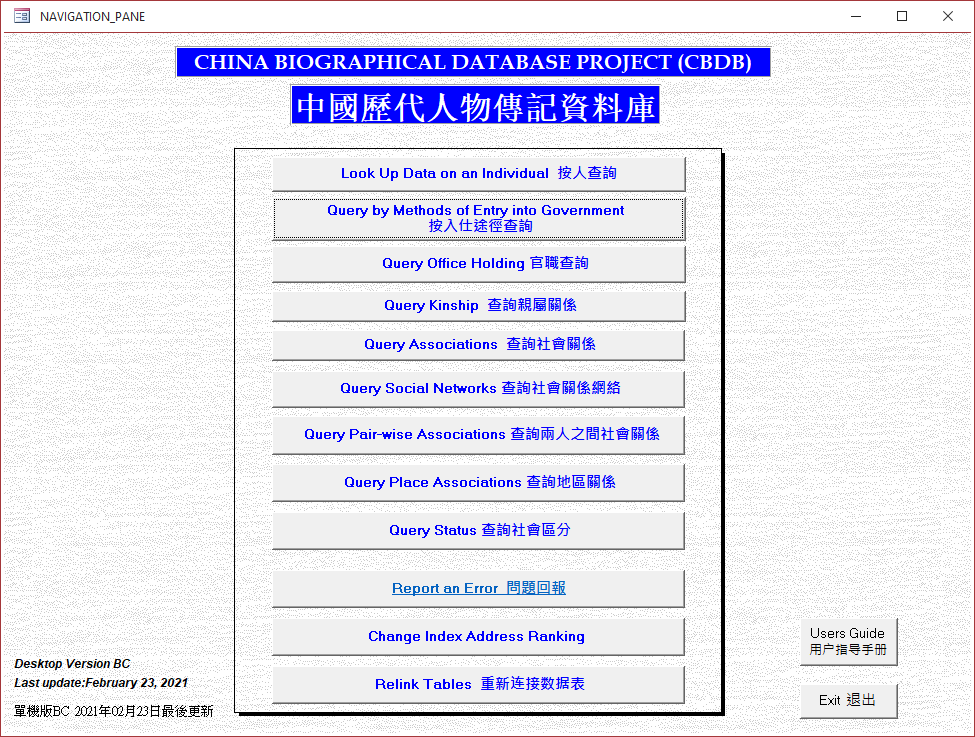

As the name suggests, the Navigation Pane is the central console for using the forms
developed for the Access version of the database. Clicking on the nine query command
buttons opens the browser and the eight analytic forms discussed above. The Navigation Pane
also has four additional functions.

1. Error Reporting: The Navigation pane also allows you to report problems with the
program. If you click on “Report an Error,” the program brings you to a Google form:

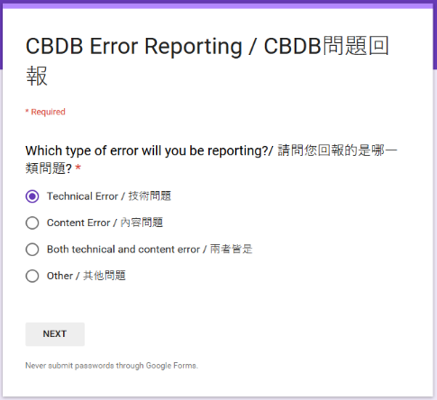

Select the type of error and fill in the information requested on the form.

2. User’s Guide: Clicking on “Users Guide” will open a copy of this User’s Guide.
3. Relinking the Data Tables: The current version of the Access database splits the CBDB
data tables from the user interface. Because the database has grown very large, the size of the
files that hold the data were approaching the limit of what Access could handle, and thus the
data tables are in three separate files. The user interface then is linked to the tables. When you
first open the user interface, the program automatically links the interface to the data tables, as
long as the three files are in the same folder as the user interface file. However, because the
data and the interface are in separate files, it is now possible to update each of these separately.

If there is a new release of the CBDB data, you can download the new data files into
your CBDB folder and then link the interface to those new files. The CBDB data release will
have a date-stamp in the form YYYYMMDD as part of the name of the files. If you click on
“Relink Tables,” a form will request the date-stamp information:

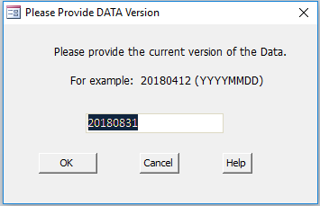

Simply fill in the new version information and click “OK.”

4. Changing the Index Address Ranking: While the default setting for how CBDB
defines index places works well for most users, scholars pursuing particular topics may need to
change how index place is defined. Clicking on this command button opens a form to allow
the user to do just this. When one opens the form, it shows the current order for selection of
categories of relation to place that is used to define the index place:

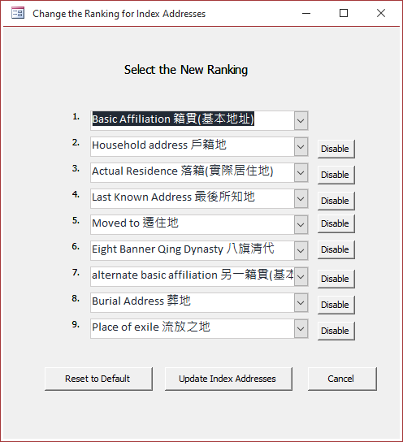

One then can choose a new set of categories to be used to define index place. Clicking on
“Disable” limits the selection process to just those categories above the disabled row:

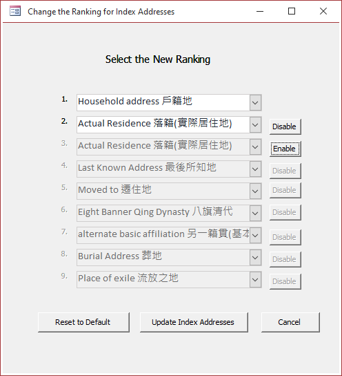

In this example, we set the first choice for index place to “Household Address” (戶籍地) and
the second to “Actual Residence” 落籍. All other relations to place are ignored. Clicking on
the “Update Index Addresses” then recalculates the index place for `BIOG_MAIN` and replaces
the values for index place in all the tables that use the value.

After changing the ranking of place affiliations, one can restore the CBDB default
ranking and index place values by simply clicking on the “Reset to Default” command button.

### B. The Browser: Looking up Data on an Individual

The browser in CBDB provides a convenient way to explore basic information on individuals
in the database. It draws on just the raw data for people in the database, so it has no significant
analytic or synthetic abilities. The only exception in is the name search functions described
below. When one opens the browser, it begins with the first person in the `BIOG_MAIN`
table. (The sorting by name starts with all people who have just a personal name but no
surname.)

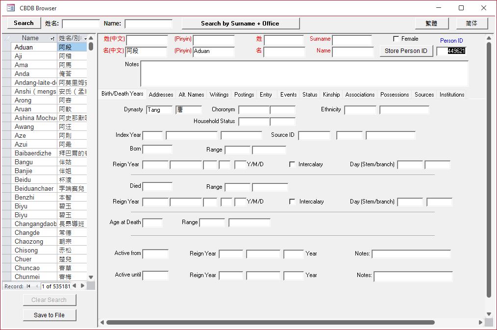

Since the CBDB interface in MS Access aspires to be bilingual, the user can switch between
English, traditional characters (繁體) and simplified characters (简体) by clicking on the buttons in
the upper right of the form.

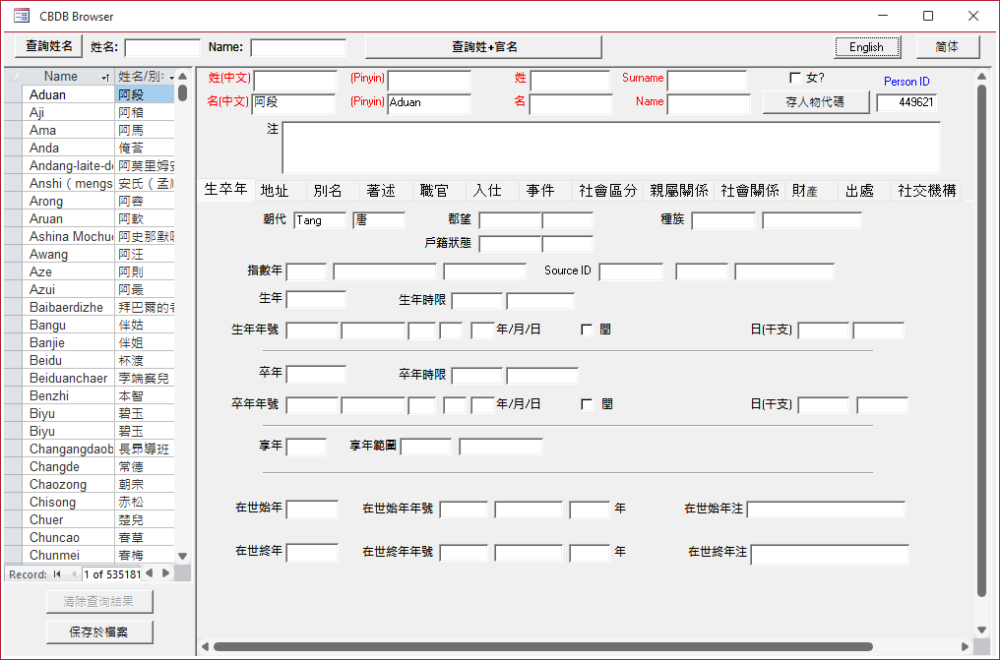

Searching the Database 

By Name

Since `BIOG_MAIN` has over 535,000 people, just scrolling through the window on the left is
not the most effective way to locate an individual. Therefore, the browser has two search
functions. The first is a search by name. “Name,” however, includes all the categories of
names used in CBDB (courtesy name 字, style name 號, etc.). Thus, if a text provides only Su
Shi’s 蘇軾 style name, Dongpo 東坡, rather than his full name, one can search by that alone to
see how many people share those two characters in any of their names. Of course, one can
directly search by “Su Shi” or “蘇軾” as well.

Searching by Pinyin

1. A basic search by pinyin (i.e., “Su Shi”) looks for the search string anywhere in the name, but
the search can be narrowed or broadened.
2. Using a lower-case name, the search looks for the phrase in any part of a name, so that “hao”
will produce “Zhao Fang,” “Shao Yong,” and “Chao Buzhi,” etc., as well as “Hao Jing” and
“Cheng Hao.”
3. If the first letter is capitalized (“Hao”), the search finds names that begin with “Hao” (“Hao Jing” and “Cheng Hao”).
4. If one adds an “!” at the beginning, the search routine looks at just surnames.

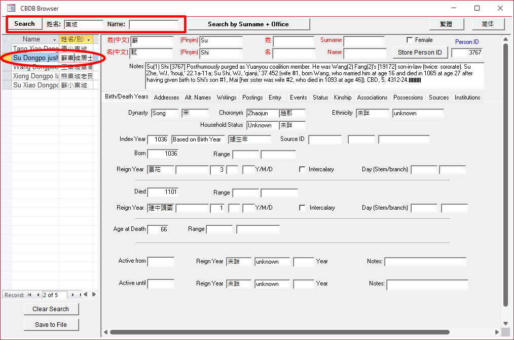

By Name + Office

If a text provides only a surname and a title, the browser allows one to search by those as well.

Clicking on the “Search by Surname + Office” command button opens a form that allows
one to not only specify the name and office but also to narrow the search by providing a range
of index years or dynasties:

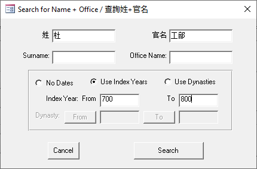

Note: Using the Chinese name and office produces more certain result, since the form simply
looks for all office titles for people with the given surname in the database. (The pinyin office
titles are in lower case with a space between each character.) Clicking on the Postings tab and
scrolling through Du Fu’s nine posts confirms that he indeed served as a Gongbu yuanwai lang.

Once one clicks the “Search” command button, if the form finds any people who
match the specified criteria, these results are transferred to the Browser:

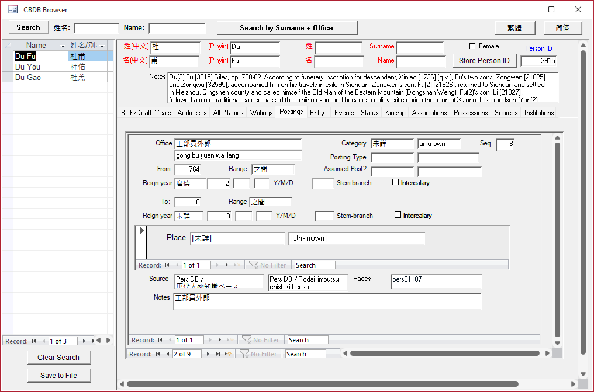

Exploring Results

The browser itself is fairly self-explanatory. Each tab provides the basic data in CBDB for the
individual in the main categories: addresses, alternative names, writings, postings, mode(s) of
entry into service, events, status, kinship relations, social relations, possessions, the sources
used for the information, and relations to institutions. The lists of social relations are just
those stored in the basic tables: they are far less complete than the lists created by
LookAtNewtworks.
The current version of the browser incorporates two significant improvements in the
display of data. The first is that the list of kin is more complete than in in earlier versions.
Those versions provided just the raw list of kin in the raw data table `KIN_DATA`. Now the
browser implements a search for the individual’s kinship network using parameters for
maximum kinship distance. The browser searches for combinations including 2 ancestor
generations, 2 descendant generations, one marriage connection and one collateral (i.e.,
brother or sister) relationship link. For greater detail, see the discussion in “Using the Form
‘Query Kinship’”

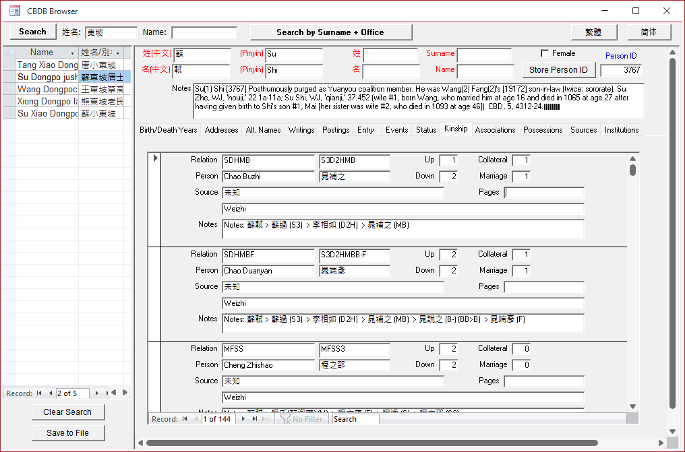

For Su Shi, the browser discovered 143 kinship relations (the first is just “ego,” Su Shi
himself). The Notes field for each kinship record provides the path that the search took to get
from Su Shi to the kin listed in the record. For Chao Buzhi, for example, the query went from
Su Shi’s third son to that son’s second daughter’s husband. Chao Buzhi was that husband’s
mother’s brother.

The second change is to provide a hyperlink to whatever databases were used to acquire
information on an individual. For Su Shi, for example, the browser provides a link to his entry
in Academia Sinica’s Naming Authority 人名權威資料 database:

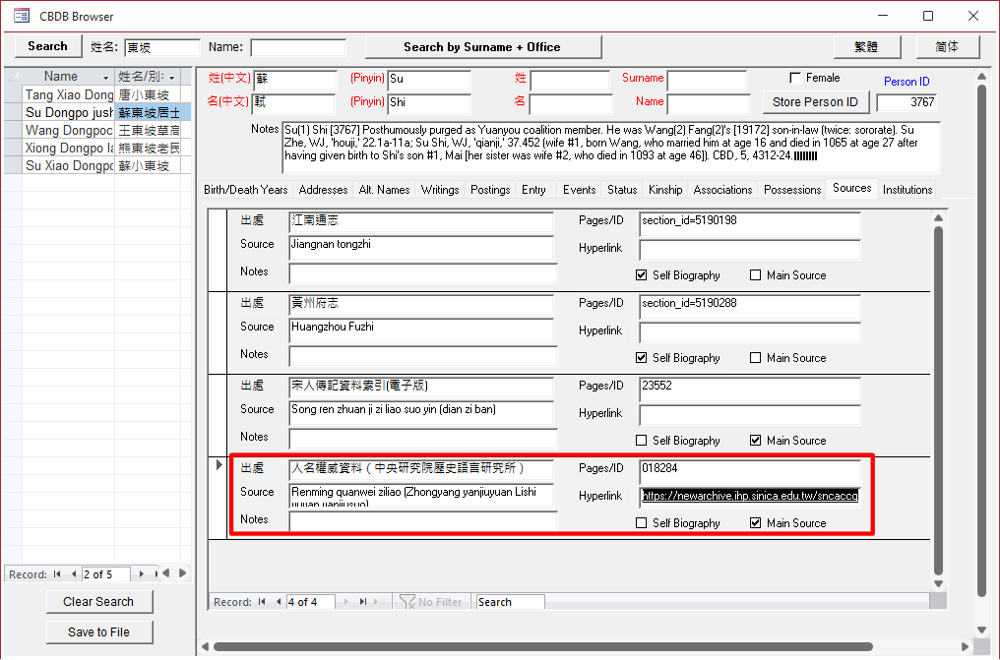

Clicking on the link takes one to Su Shi’s entry:

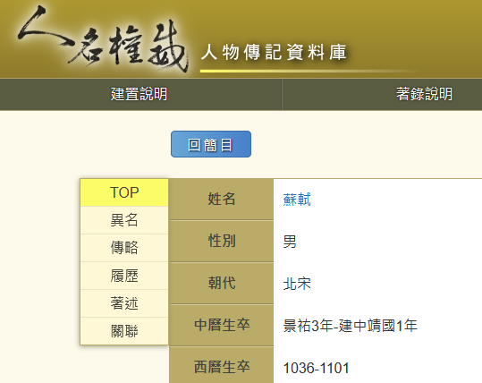

Saving Results

A. Having located a person, one can use the Store Person ID button to save the person’s ID to
be reused in Query Kinship, Query Social Networks, and Query Pair-wise Associations.

B. One can save all the information assembled in the browser to an HTML file by clicking on
the Save to File command button.

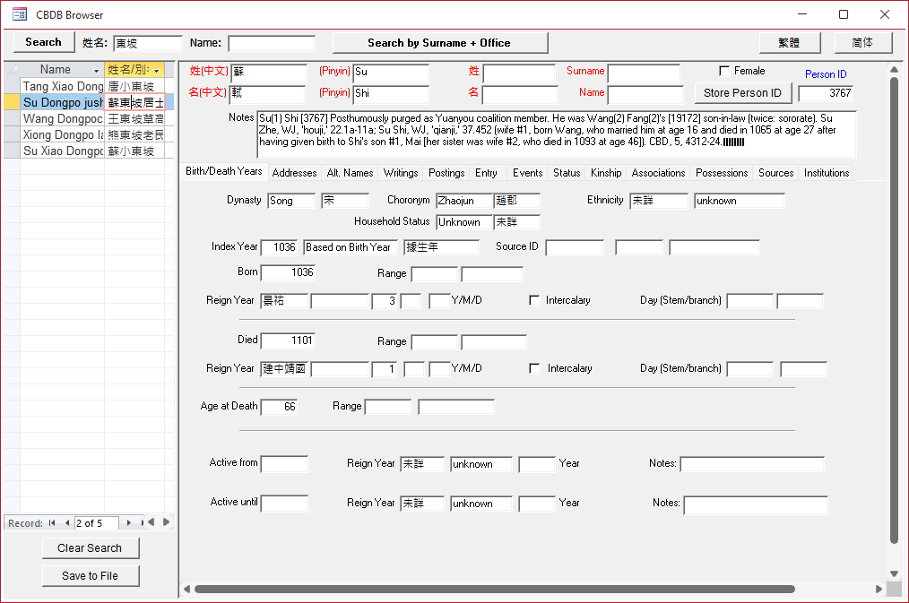

At present, the HTML file is in a very simple format (the displayed information here is just the
beginning of the file):

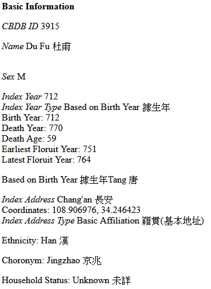

### C. Using the Form “Query by Methods of Entry into Government”

LookAtEntry is the simplest form. One opens it by clicking on “Query by Methods of Entry
into Government” on the main page and clicks on the “Select Entry” button to choose a
category:

Note that all of the forms have the option to switch between English, traditional or simplified
Chinese. When one clicks on the “繁體” label, it then gives one the option to return to
English:

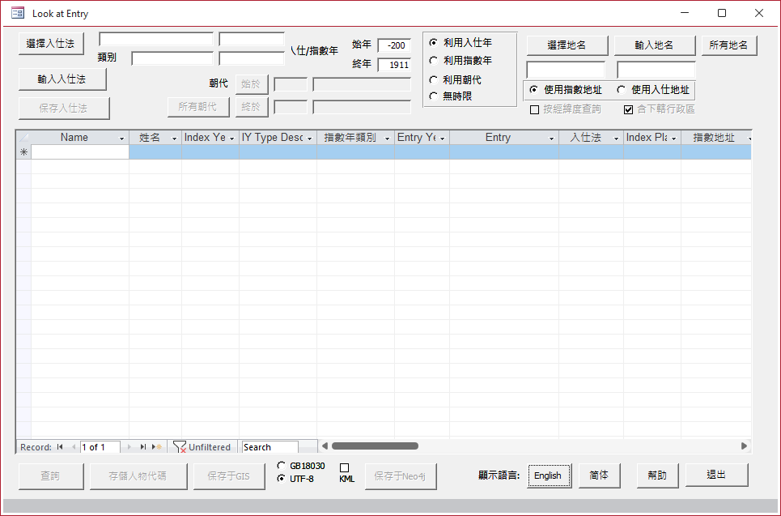

Selecting the Modes of Entry

Clicking on the Select Entry button opens a form with a list of options. Since there are many
different ways to attain eligibility for office, CBDB uses a collapsible tree to simplify the
selection process:

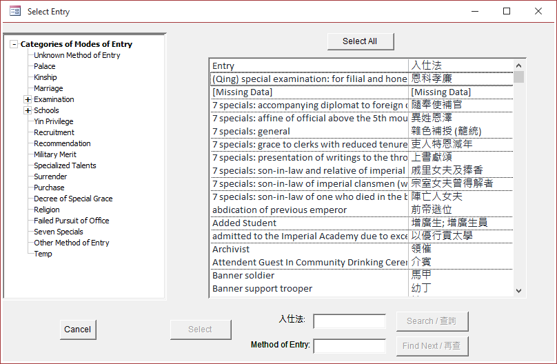

One can narrow the choices by looking at a particular general type of entry which is on the
menu on the left of the window (A1):

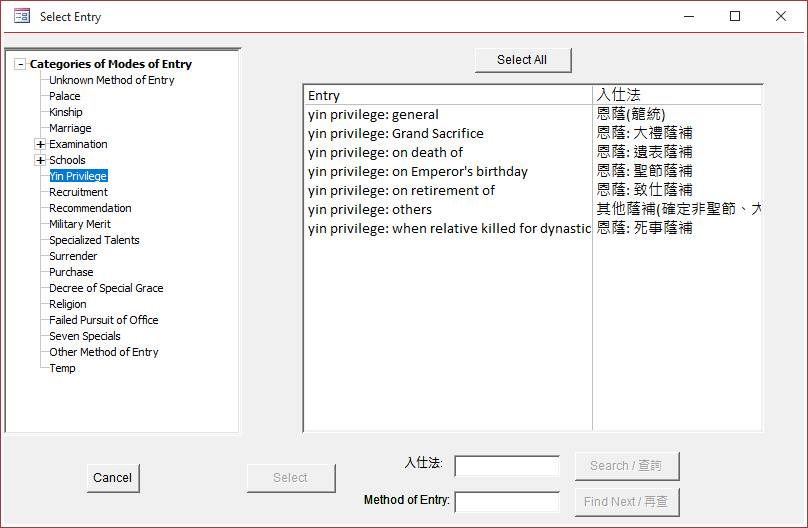

One can either select a specific method of entry from the menu on the right or select all the
listed methods (A2). One also can search for a specific method using the search box located on
the bottom right corner (B1). The searching rules for CBDB are to first look for the search
phrase at the beginning of the text and then look within the text. If CBDB finds the search, you
can search for the next instance of the phrase (B2), if the first is not what you seek by clicking
on the “Find Next” button:

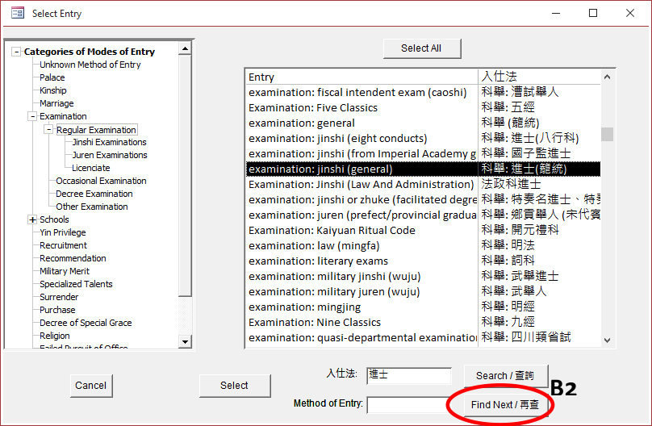

Often one wants to look at several categories within a selected type of mode of entry. CBDB
now allows one to select one, two or more method of entry. Simply click to select or to un-select:

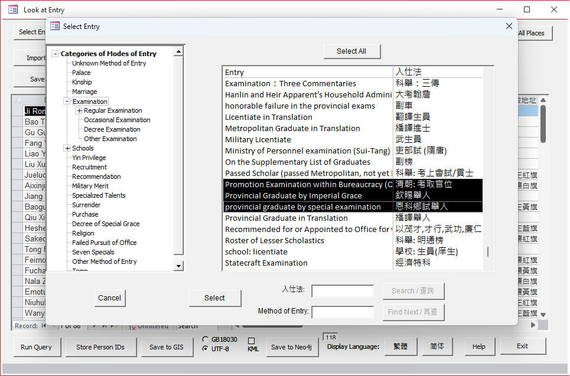

As of version BG of the interface, one can save the list of modes of entry one has selected.
Saving the list gives one additional flexibility, since one can combine or edit lists for later use.

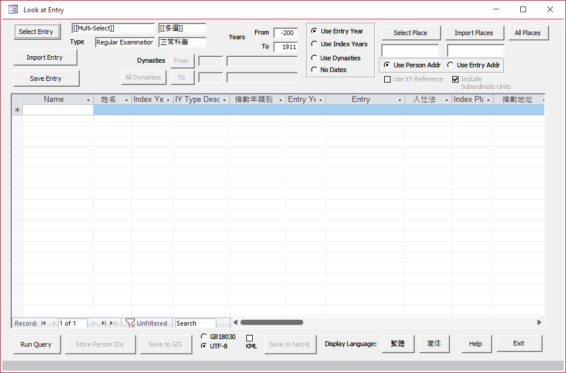

After selecting the combination of modes of entry one wants to explore, one can save them to a
text file by clicking on Save Entry. This will open a “File Save” dialog box:

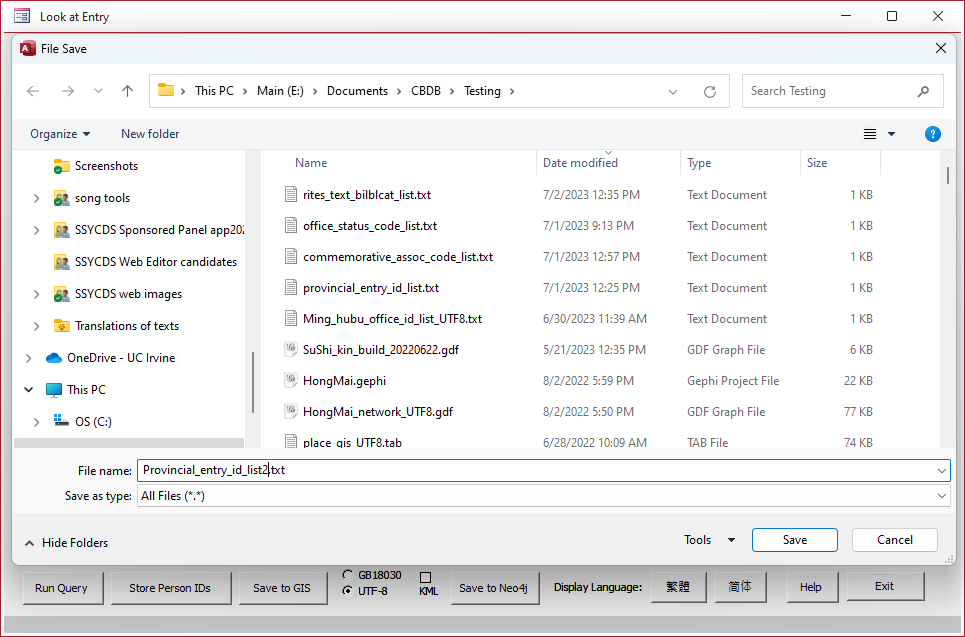

Once one has saved the file, it can be imported again by clicking on Import Entry. This will
open an “File Open” dialog box.

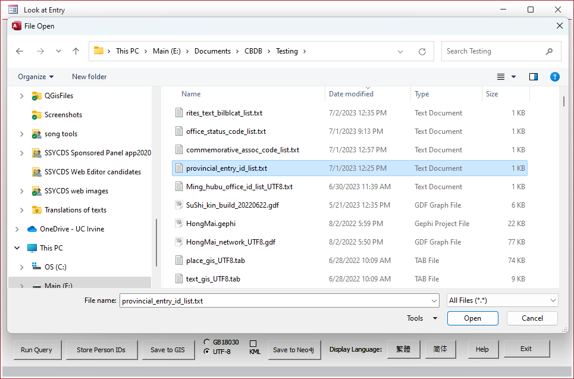

After selecting the file to import and clicking on Open, the form will show that it is using an
imported list, and one can run the query using the list:

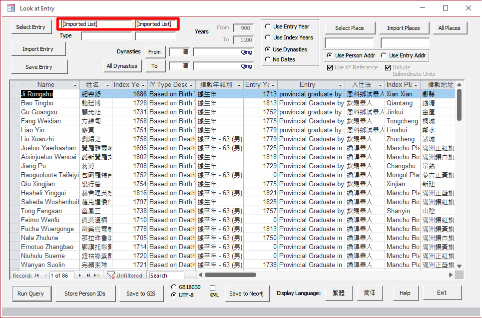

Setting Search Parameters

Setting Time Parameters

After one finds the method(s) of entry and clicks Select, one returns to the LookAtEntry
form, and can now choose the year range (1) to run the query (2):

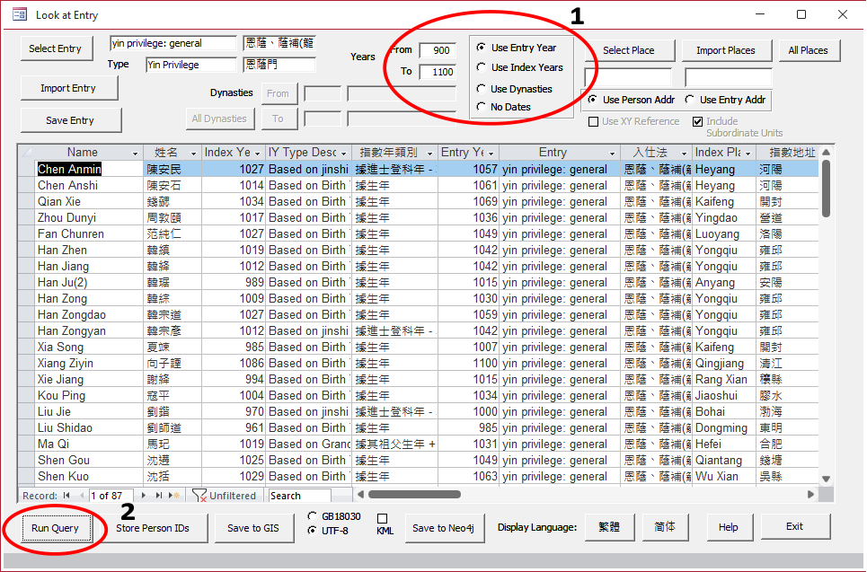

The form allows one to choose either the entry year or the index year of the person. (The index
year is included in the search if the box “Use Index Years” is selected.) Because in many cases
we do not know the entry year (given as zero in that case), it may prove useful to run the same
query with the “Use Index Years” option selected:

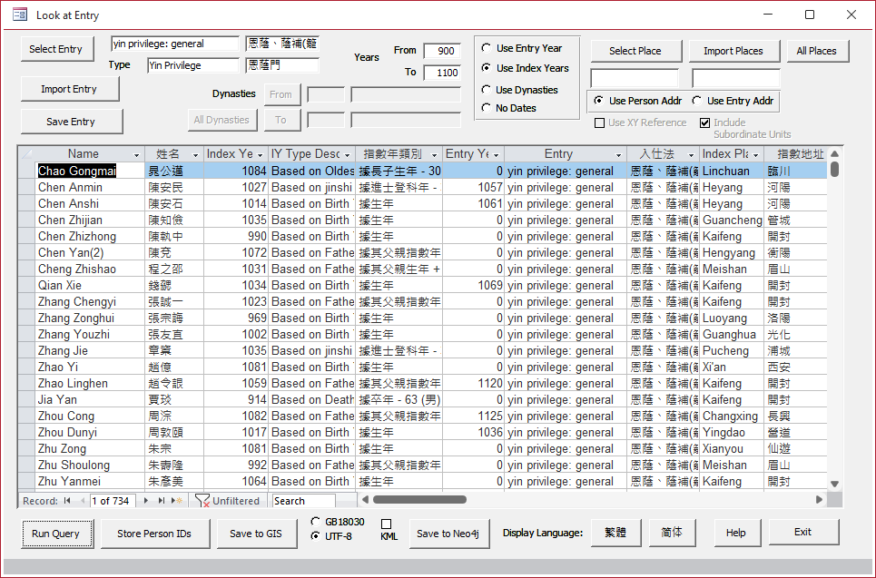

Note the number of 0s in the “Entry Year” column. This approach yields 734 records,
compared with just 87 when using the entry year. However, there are people for whom we
know the dynasty but do not know their index year. The search by dynasty is less fine-grained: although we are looking for the Five Dynasties and Northern Song Dynasty, the entire Song Dynasty has just one dynastic code. For this search, we identify 1,341 people, of whom 134 have no index year. However, 10 of those people do have years of entry:

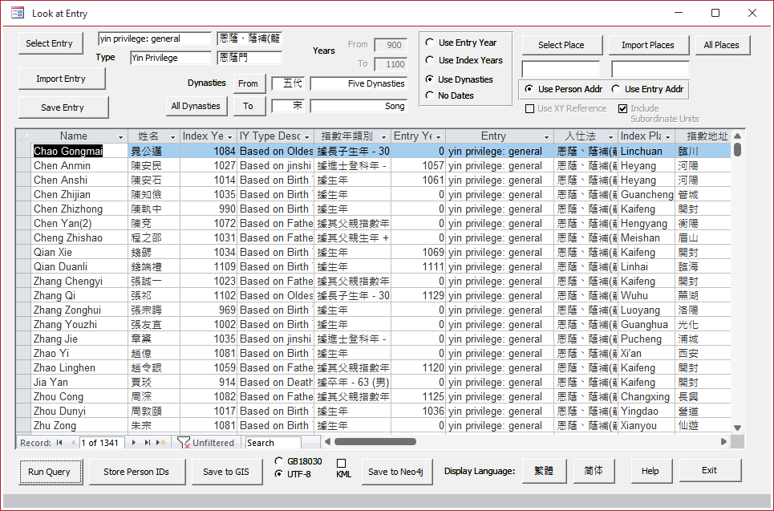

The table the query produces has 32 columns:

* Name (Pinyin)
* Name (Chinese)
* Index Year
* Index Year Type (English)
    (how the Index Year was derived)
* Index Year Type (Chinese)
* Entry Year
* Description of Entry (English)
* Description of Entry (Chinese)
* Person’s Index Place (Pinyin)
* Person’s Index Place (Chinese)
* Type of Place Association
    (the type of place association used in assigning an index place)
* X-coordinate of Index Place
    (CBDB uses administrative seats)
* Y-coordinate of Index Place
* Count of XY coordinates
    (CBDB calculates how many people in the table share the same index place)
* Exam Rank
    (Given, if known. It does not apply to entry through yin privilege.)
* Kinship Relation
    (Yin privilege allows a person to become eligible for service based on the merit of a relative. If CBDB knows who that relative was and what the relationship was, the table gives this)
* Kin Name (Pinyin)
* Kin Name (Chinese)
* Associate Name (Pinyin)
    (Sometimes people are granted entry into government through recommendation or through the role of some other non-kin associate)
* Associate Name (Chinese)
* Association
    (The type of association)
* Person ID
* Dynasty (English)
* Dynasty (Chinese)
* Index Year Type Code
* Parental Status (English)
    (For those sources that note whether the parents are alive at the time of passing the examination.)
* Parental Status (Chinese)
* Place of Entry (Pinyin)
* Place of Entry (Chinese)
* Place of Entry X-coordinates
* Place of Entry Y-coordinates
* Place of Entry XY Count
    (One can sort the table using any of these columns. For example, “Index Year” may be useful. Left-Click on the column name “Index Year” to select the column and then Right-Click to choose from the sorting options:)

One can sort the table using any of these columns. For example, “Index Year” may be useful.
Left-Click on the column name “Index Year” to select the column and then Right-Click to
choose from the sorting options:

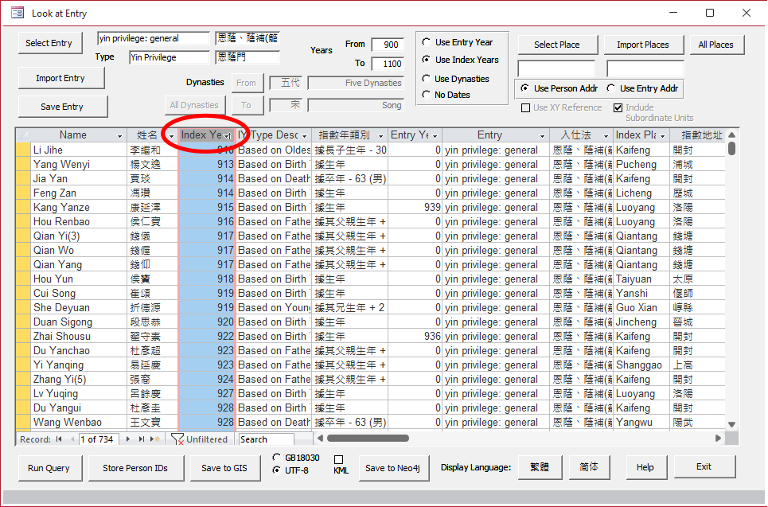

If one wishes to save the table, the simplest method is to select the entire table by clicking on
the small box in the upper left-hand corner. Then save to the clipboard with Ctrl-C.

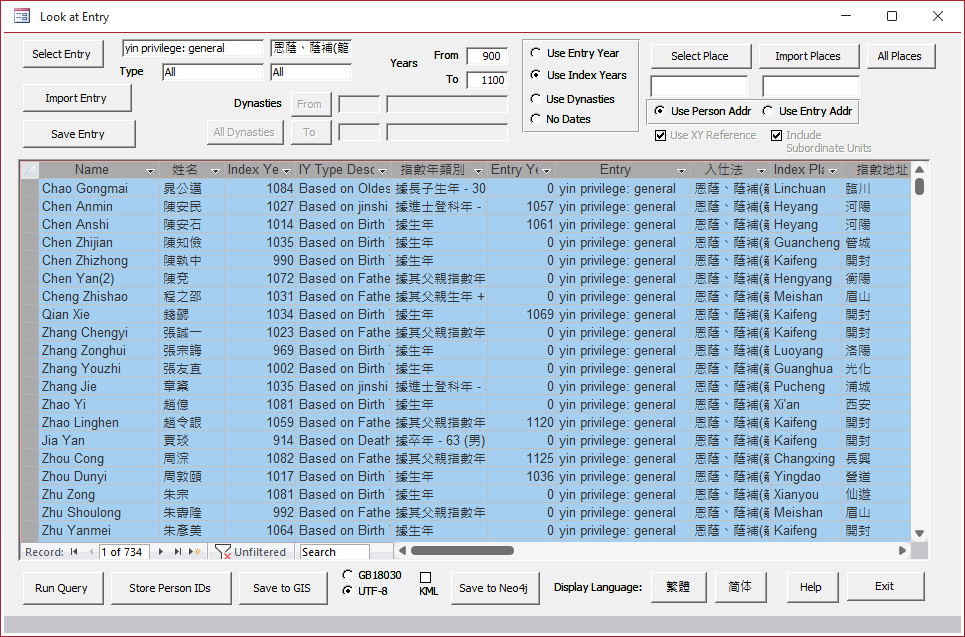

One then can paste the table into any program that accepts the format.

Setting Place Parameters

If one wishes to explore the mode of entry for people from a particular region, one uses the
Select Place button in the upper right part of the form:

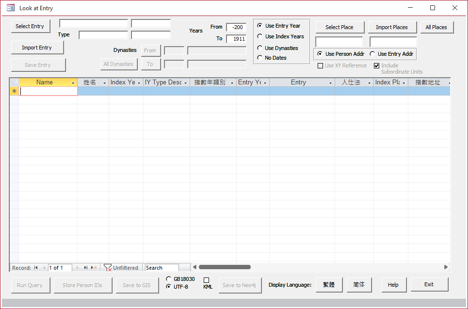

This opens the Select Address form. One can search for a place name using the filter box: to
filter by Kaifeng 開封, enter “Kaifeng” into the Filter text box and then click the Filter
command button. This gives a list of all places that begin with the word “Kaifeng.” (Using
the Chinese, here 開封, is better to avoid the possibility of homonyms.)

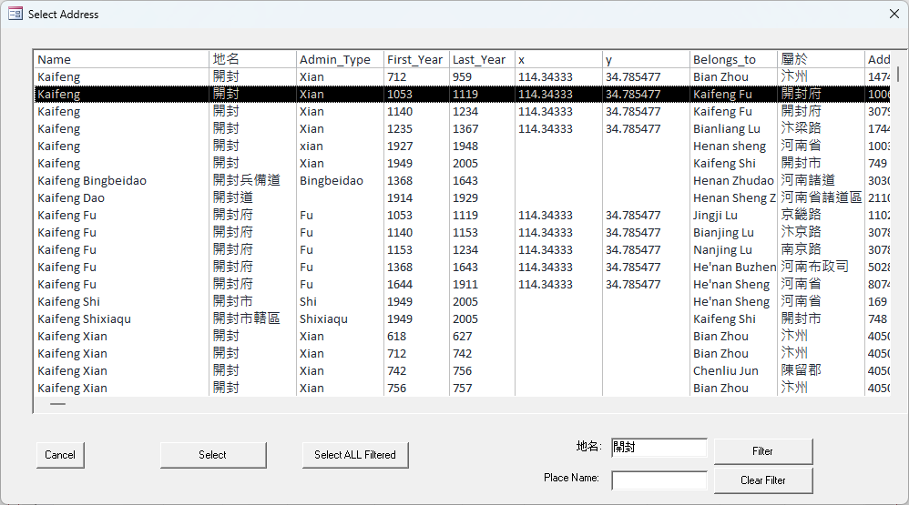

Note that there are many addresses for Kaifeng. We will select the Kaifeng county active from
1053 to 1119 by clicking on the corresponding row and clicking Select; this will return us to
the main window, where we can run another query.

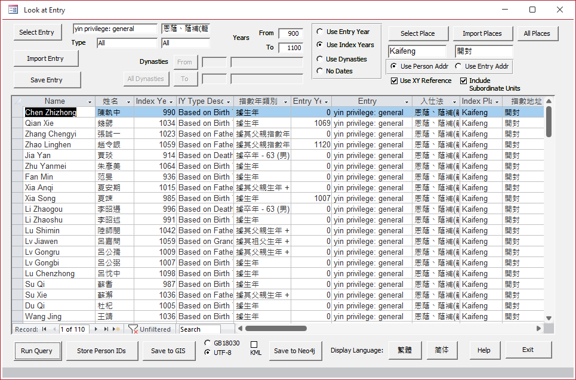

Because the index years start in 900, before the county code, we select “Use XY Reference” to
include codes for the region before 1053. Using the single address for Kaifeng produces 110 people.
If one wishes to look at Kaifeng more broadly, return to the Select Address form and once
again enter “Kaifeng” into the Filter text box and then click the Filter command button. Then
either select ALL the filtered addresses by clicking on the “Select ALL Filtered” button. This
will return you to the main LookAtEntry form, with all the Kaifeng codes selected; by
including the prefecture (Kaifeng Fu) all its subordinate counties will be included:

The Place text fields will show the filter term in a pair of square brackets, here “[[Kaifeng]].”
Running the query now produces 156 records for people from Kaifeng whose index years
were between 900 and 1100 and who entered government service through the yin privilege.

If all of the address IDs for Kaifeng are too many, one can limit the number of codes in
the Select Address form by selecting just those that are relevant and then click on “Select:”

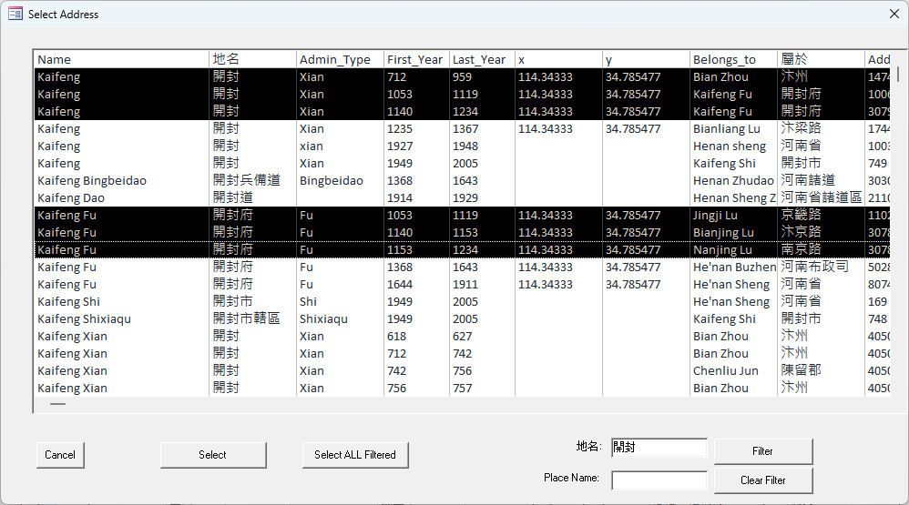

When one selects more than one address, the Query by Method of Entry form will have
“[[Multi-Select]]/[[多選]]” instead of a place name. A search for yin privilege for people with
index years between 900 and 1100 using these address codes produces 159 records.

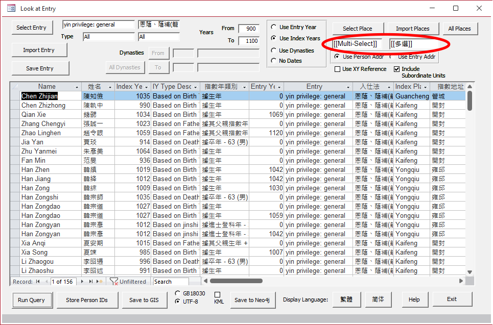

If one wishes more precisely and flexibly to control the address codes in one’s search, one can
create a text file with a list of address codes. Using the example of Kaifeng, for instance, one
can select all the filtered records in the Select Address form, paste the records into a new
Word or Excel file, delete the records one does not want, and copy the Address IDs to text file.

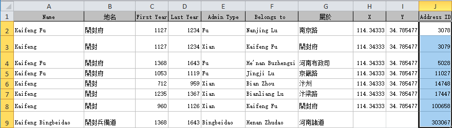

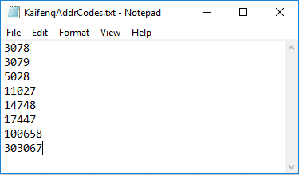

The importing routine checks the list against the address codes in `ADDR_CODES` and moves
invalid codes to an ImportErrorList table for your inspection. (The table ImportErrorList is
listed on the left-hand part of the Access screen. To view it, just double-click on it.)

Now click on the Import Places button in the LookAtEntry form and select the file to
be imported. (CBDB gives a warning when it reads the list of IDs and finds an invalid ID.) If
the import has been successful, one will see “[Imported List]” in the Place Information text
boxes. Once the list has been imported, set the other parameters, and run the query.

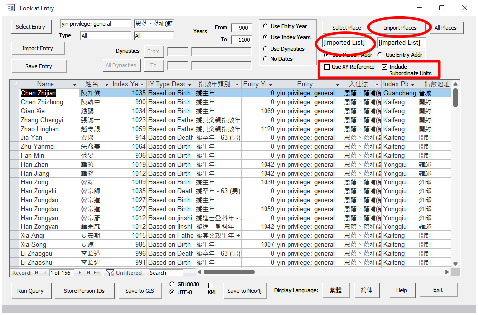

This approach produces 156 people, the same as the filtered version. However, note the
Include Subordinate Units checkbox in the upper right corner. One of the places on the
imported list was the Kaifeng Superior Prefecture 開封府: it has other counties subordinate to
it that are included in the search when the checkbox is selected. This is the default setting.
Note that the table includes people from Yongqiu 雍邱 and Guancheng 管城: these are
administrative units subordinate to Kaifeng Superior Prefecture and included in the search. If
one unclicks the Include Subordinate Units checkbox, these counties disappear from the
search, which then produced just 105 people.

There is one additional approach to searching by name that handles the problem of when a
place name might change and thus be excluded from a list using names. During the Later Jin (936-
947), for example, Kaifeng was called by its old name, Bianzhou. CBDB allows one to pick
one address (or a filtered or imported list of addresses) and, based on its longitude and latitude,

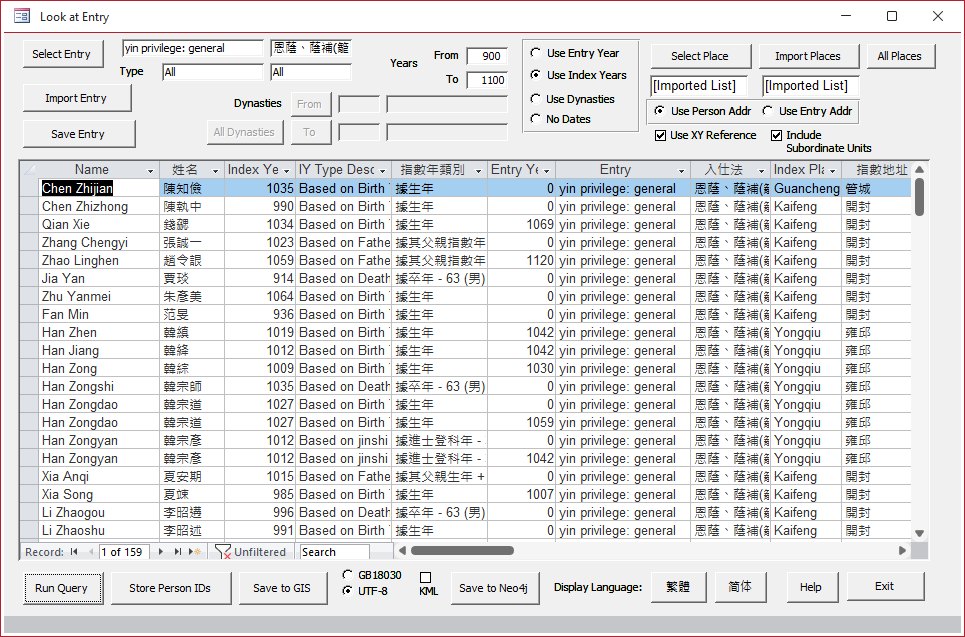

to find all the administrative units throughout the specified time period that were close to that
unit. If one imports the list of address codes for Kaifeng above and checks the Use the XY
Reference checkbox as well as the Include Subordinate Units checkbox, one finds 159
people.

Saving Results

If one has created a query that produces a list of people who one wants to reuse in other
queries—for example, if one wants to look at the kinship networks for the officials from
Kaifeng who entered government service through yin privilege—one can store the list of
people for reuse in the forms that use Person IDs as input (LookAtKinship, LookAtNetworks,
LookAtAssociationPairs).

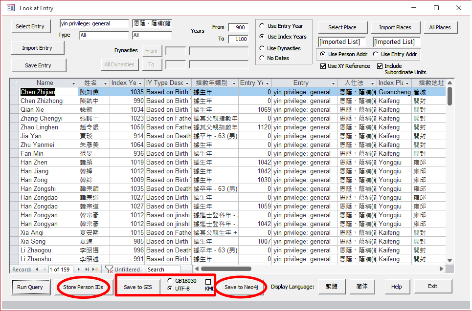

Simply click on the Store Person IDs button in this form and then click on the Recall
Person IDs in the other form.

If one wishes to save the results to a file readable by a GIS program, one selects the
coding for the file and clicks on the Save to GIS button at the bottom of the form. The table
is saved to a text file, by default, “entry_gis.txt.” One can specify the encoding of the text file
as either GB18030 or UTF-8.

CBDB results also can be saved in KML format, the standard for importing CBDB query
results into Google Earth.

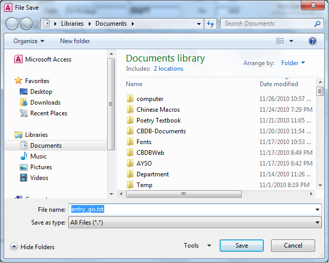

Starting with user interface version BF, CBDB now also allows one to save the results
of a search to a set of files that can be opened with Neo4j or other graph databases (see
https://neo4j.com/developer/graph-database/ ). One selects the encoding and then clicks on Save to Neo4j. For the Kaifeng search in our example, the program creates seven .csv
(“comma-separated values”) files:

    EntryCode_UTF8.csv
    KinshipCodes_UTF8.csv
    People_UTF8.csv
    PeopleEntry_UTF8.csv
    PeoplePlaces_UTF8.csv
    PeoplePlaceCodes_UTF8.csv
    Places_UTF8.csv

The seven files create graph representations of the various aspects of the data created through
the search.

All the search forms support output to Neo4j but vary in the number of files created,
depending on the nature of the data collected through the forms’ queries.

### D. Using the Form “Query Associations”

LookAtAssociations allows one to look at the people who have participated in particular associations or categories of associations. After opening the form, one clicks on “Select Association” to choose the type of association one wants to investigate.

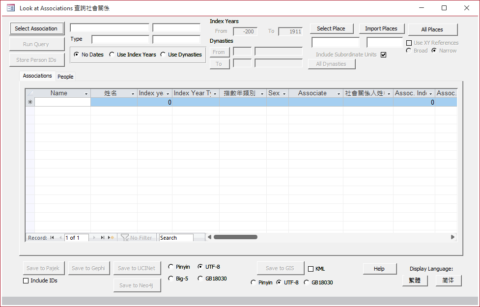

There are over four hundred categories of associations, so CBDB allows one to pick by type and subtype.

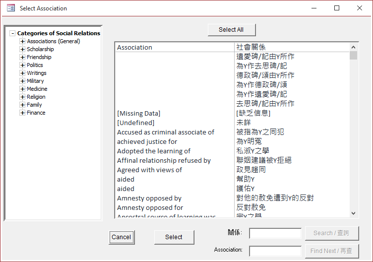

Consider the “Scholarship” associations from the list on the left. Under “Scholarship” there are seven subtypes. The subtype “intellectual affiliations” in turn has seventeen categories of associations. As with selecting entry codes, one can select the relevant codes.

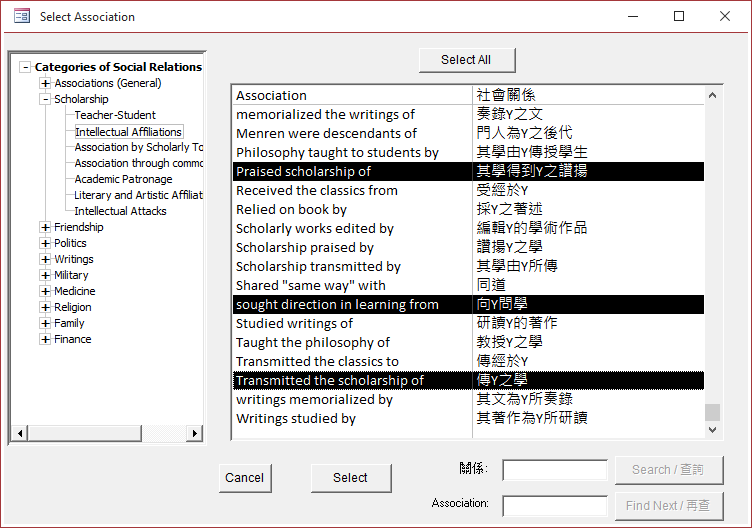

One also can select all of the subtypes simply by clicking on the “Select All” command button
at the top and then clicking on the “Select” button at the bottom center:

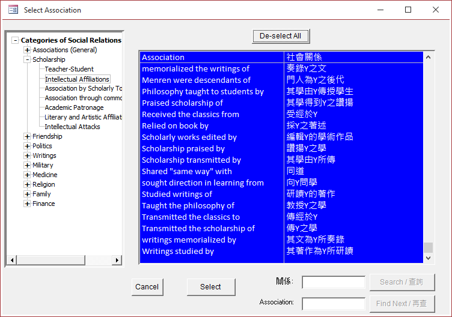

Note that, as with entry, one can search for terms in the table of associations in both English
and Chinese (using the search box at the bottom right corner) and search again if the first item
found is not what you are looking for. In the screenshot below, I have selected all intellectual
affiliation associations (1) as the subtype of association. I then chose the year between 900 and
1400 (2), and ran the query (3):

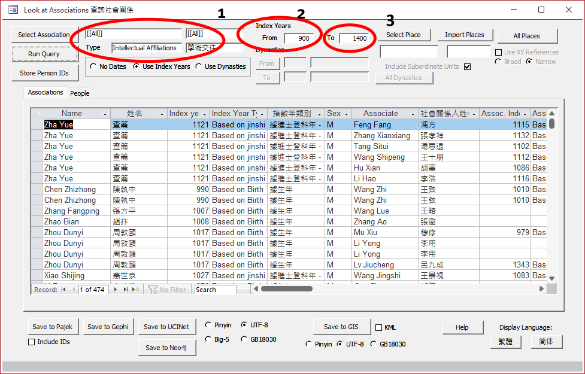

Although dates are a part of the `ASSOC_DATA` table, we do not have date information for
most associations, and LookAtAssociations uses the index year of the individuals to see
whether they fall within the specified beginning and end dates.

Using the index year of people, however, introduces a significant limitation at the same time that it allows one to focus on specific timeframes: people for whom CBDB does not have an index year simply disappear from the results. This CBDB allows one to search without using the index years by unchecking the Use Index Years box directly below the input boxes for years:

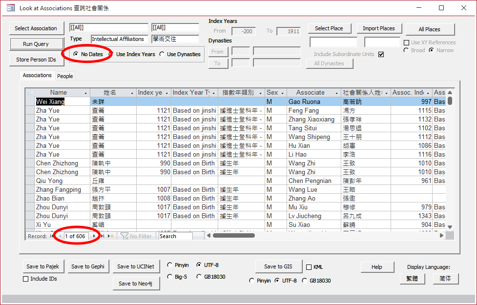

Note that the results rise from 474 to 606. One can sort on index years after doing the search to look for the relevant associations.

The Associations table in LookAtAssociations has 40 columns to display the types
of information recorded in the ASSOC_DATA table:

* Name (Pinyin)
* Name (Chinese)
* Index Year
* Sex
* Associated Person’s Name (Pinyin)
* Associated Person’s Name (Chinese)
* Associated Person’s Index Year
* Associated Person’s Sex
* Association Category (English)
* Association Category (Chinese)
* Association Count (This gives the number of objects or events that established the association)
* Address (English) (This is the index place, if known.)
* Address (Chinese)
* X-coordinate (These are the coordinates for the address above.)
* Y-coordinate
* Associate’s Address (English)
* Associate’s Address (Chinese)
* Associate’s X-coordinate
* Associate’s Y-coordinate
* Kinship Relation (English) (The next four columns are for associations created through actions for the sake of a kin)
* Kinship Relation (Chinese)
* Kin Name (pinyin)
* Kin Name (Chinese)
* Associate’s Kinship Relation (English) (The next four columns are for associations created through actions for the sake of the associate’s kin)
* Associate’s Kinship Relation (Chinese)
* Associate’s Kin Name (pinyin)
* Associate’s Kin Name (Chinese)
* Index Year Type (English)
* Index Year Type (Chinese)
* Dynasty (Pinyin)
* Dynasty (Chinese)
* Associate Index Year Type (English)
* Associate Index Year Type (Chinese)
* Associate Dynasty (Pinyin)
* Associate Dynasty (Chinese)
* Distance (If CBDB has the coordinates for the place identification for both people, it calculates the great-circle arc distance between them (in kilometers).)
* Index Type Code
* Dynasty Code
* Associate Index Type Code
* Associate Dynasty Code

In addition to the table of associations, LookAtAssociations also provides a table listing all the people involved in the association one is investigating. One views this table simply by clicking on the People in Association tab. This table provides information about association with place.

This table has 19 columns:

* Name (pinyin)
* Name (Chinese)
* Index Year
* Index Year Type (English)
* Index Year Type (Chinese)
* Dynasty (Pinyin)
* Dynasty (Chinese)
* Sex
* Index Place (pinyin)
* Index Place (Chinese)
* Index Place Type (English)
* Index Place Type (Chinese)
* X-coordinate
* Y-coordinate
* XY-count
* Person ID
* Index Year Type Code
* Dynasty Code
* Index Place Type Code

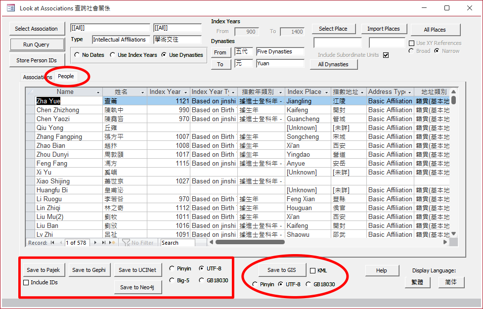

One can save the address information for display through a GIS program by clicking on the Save to GIS. Since association data provides an implicit social network linking the groups of people connected by the category of association being examined, one can save the network for analysis in the Pajek format, for example, by clicking on the Save to Pajek button. Pajek is one standard format for visualization in social network analysis (SNA). In addition data can be saved to Gephi or UCINet, and many programs can read it and convert it to other formats.
CBDB allows files for both GIS programs and for Pajek to be saved in different text encodings to enable the use of Chinese characters. Note that there is an option to include the Person ID with the node information in the Pajek files. Finally, one can also save the data to Neo4j files.

Search by Place

Like the LookAtEntry form, LookAtAssociations allows one to look at associations for
people from a particular place or from a particular list of places.

Like the LookAtEntry form, LookAtAssociations has an option when searching for
a specific place: search by XY Reference. One uses the XY coordinates of the selected
administrative unit(s) to locate other units through the specified time span whose coordinates
are close to those of selected place(s). In LookAtAssociations, one choose either a narrow
bounding box to define administrative units close to the units one has chosen, or one can
choose a slightly larger box that may include additional units by clicking on the radio button
labelled Broad under the “Use XY References” check box. This feature is particularly useful
when administrative units change name in a way that cannot be caught by simply filtering by
name. In this case, CBDB uses the Kaifeng administrative unit in the Northern Song, and it
turns out that the results are the same if one chooses either “Narrow” or “Broad:”

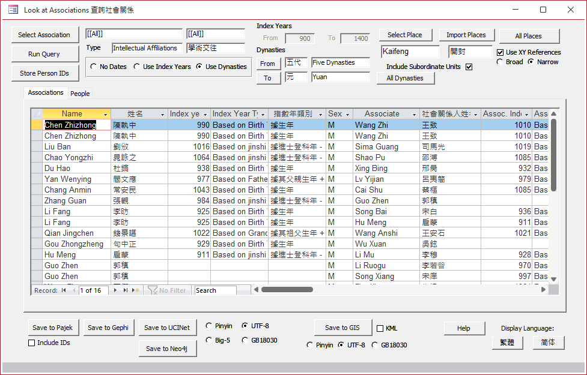

Like all other tables, LookAt Associations allows one to store the results of a query for later use
in another form. One clicks on the “Store Person IDs” button.

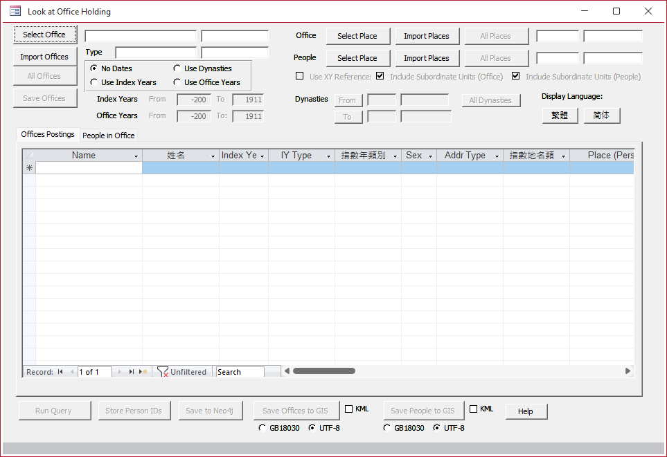

### E. Using the Form “Query Offices Holding”

The bureaucratic system of imperial China was complex, and it evolved over time. As a result,
CBDB at present has over six thousand office codes and will certainly have many more as the
database extends its coverage to all of pre-modern China. Thus a central challenge in offering
a useful approach to the examination of people’s roles in office is how to aggregate the plethora
of offices into larger units for analysis. LookAtOffice provides both hierarchical and
functional groupings. When one opens LookAtOffice, it looks much like the other simple
analytic forms. One clicks on the Select Office button on the top left to begin.

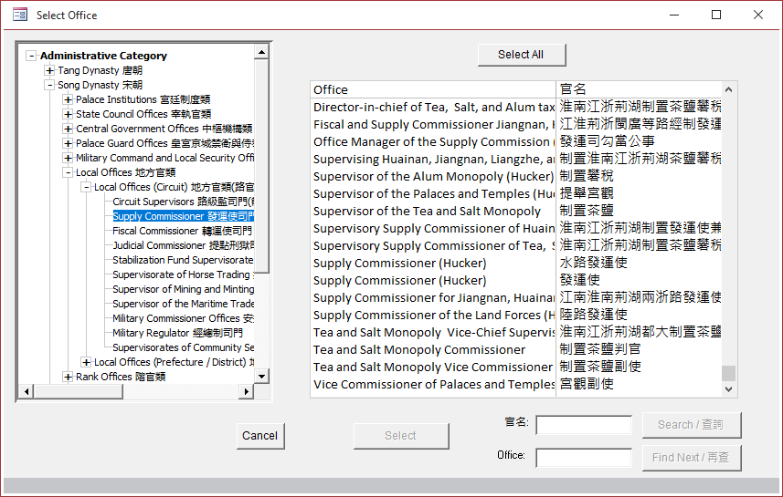

Selecting the Offices

The “Select Office” form displays a tree of office categories. The first node, “Bureaucratic
Structure” shows the organizational hierarchy organized by dynasty. One can view—and
select—the offices at any level of structure. The first form shows all the offices associated with
the Supply Commissioner at the circuit level.
One also can search for particular terms. Because there are not yet tree structures to
explore bureaucratic organization of dynasties other than the Tang, Song, and Yuan, filtering
by the Chinese term (most records do not yet have English equivalents) is the best way to find
particular offices in other dynasties. Filtering for “salt” 鹽 (see the second form below) lists all
titles of offices in all dynasties. One can scroll up (the form initially goes to the last record in the
table) to find the Tang dynasty offices. As in other forms, one can pick more than one office
title.

Offices in the Supply Commissioner’s Office in the Song Dynasty

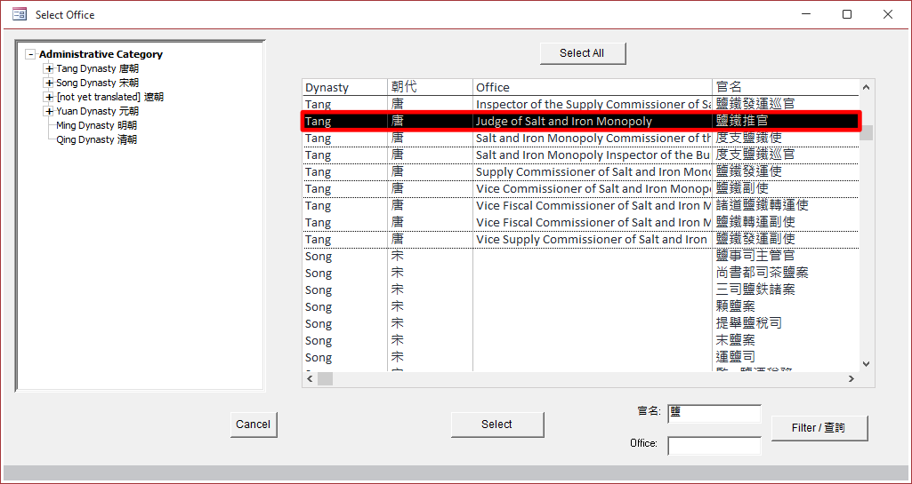

A Tang office containing the character 鹽 (“salt”)

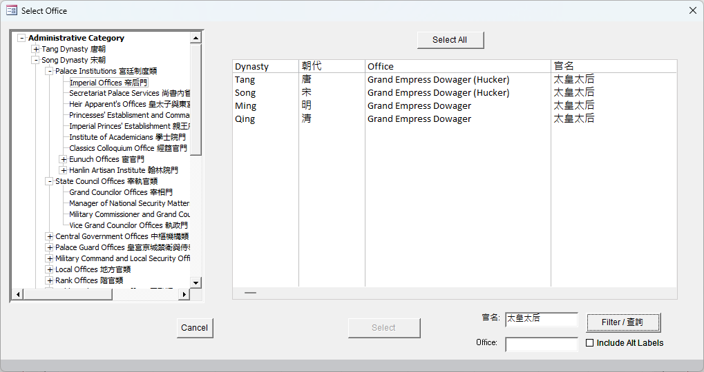

The filter allows one to select related offices across dynastic boundaries. One can select
individual offices related to salt, or one can select all offices.

Cross-dynastic Office Selection

One can use the filter for office names to find a set of offices that crosses dynastic
boundaries and, therefore, allows one to make cross-dynastic comparisons. For example, one can search for all the Grand Empress Dowagers:

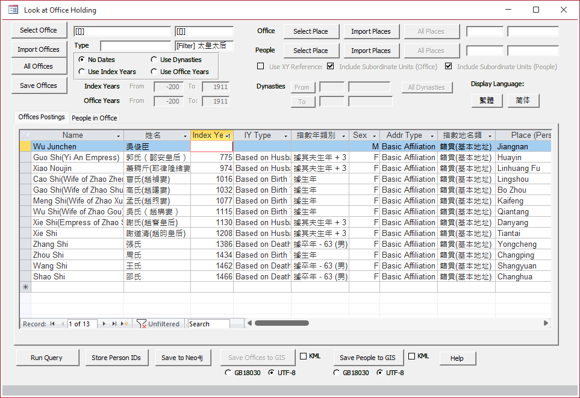

Selecting these office titles, one can locate all the women in CBDB who served as Grand
Empress Dowager:

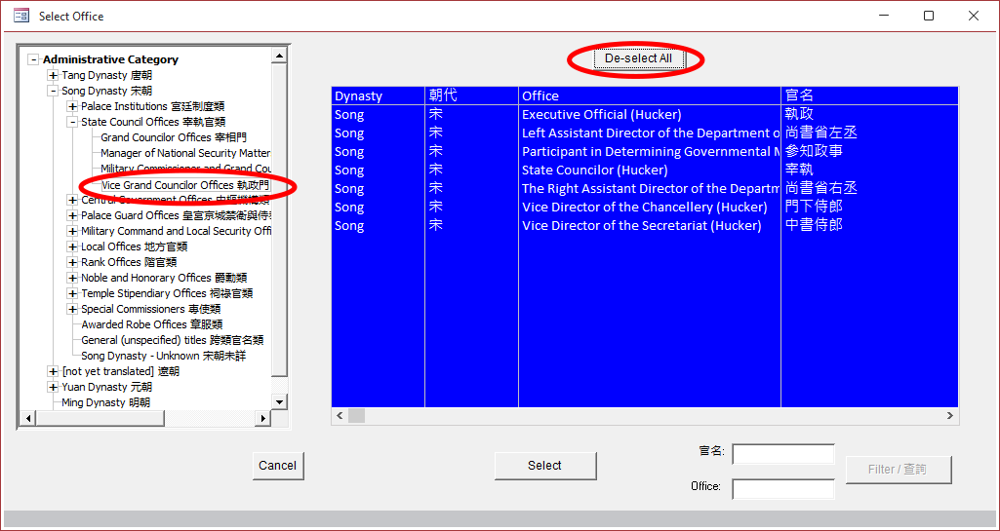

Saving, Editing and Importing Lists of Offices

Because of the complexity of office structure—and especially structures across dynastic
boundaries, CBDB provides a way to build reusable lists of offices that one might want to
investigate. One begins by selecting an initial set of offices: for example, the Song dynasty
offices in the Vice Grand Councilor’s Office:
One can save this list by clicking on the Save Offices button:
This command opens a “Save File” dialog box:

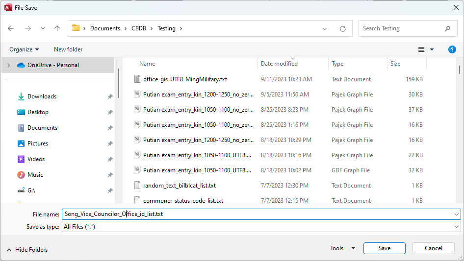

Once one has saved the file (as a text file), one can edit it in the usual manner:
The file begins with the office ID, then a <Tab> character, then the rest of the information.
Lists of office IDs from different files can be combined and imported back into the form.

Clicking the button will open an “Open file” dialog box:

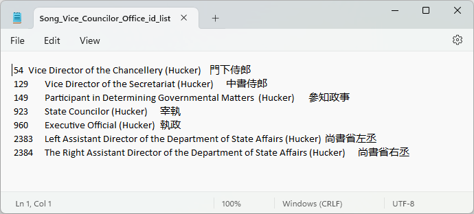

The form then displays “[[Imported List]],” and one can run a query using the list:
Querying Office
The form below shows a query selecting all postings to offices associated with the Vice Grand
Councilor in CBDB and does not use either index years or dynasties. Because at present office
codes are tied to dynasty, in fact all the results are from the Song (although one can use filtering by

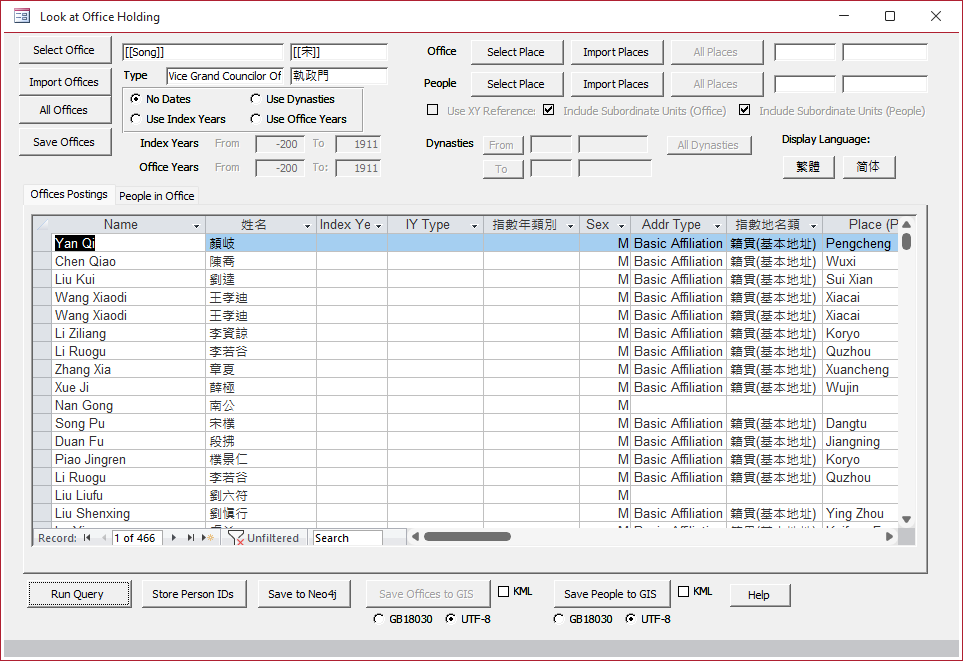

office name to create a cross-dynastic list of office codes):

The query generates two tabbed pages of results. The first, Office Postings, displays
information about all the postings to the offices being examined. The second, People in
Office, lists the people who were appointed to the offices. This list of people is particularly
useful if one wishes to then import it into the LookAtNetworks form to explore the social

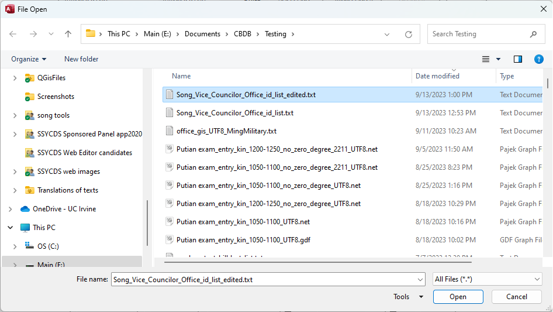

networks connecting the people who held a particular office. (One clicks on the square in the
upper left corner to select all the records, copies them (Ctrl-c), and pastes them to a text file.

If one sets a time filter to the Ming dynasty for offices from the Song dynasty, as expected, one
gets no results:
One can also set a filter for a range of years for which appointments to selected offices

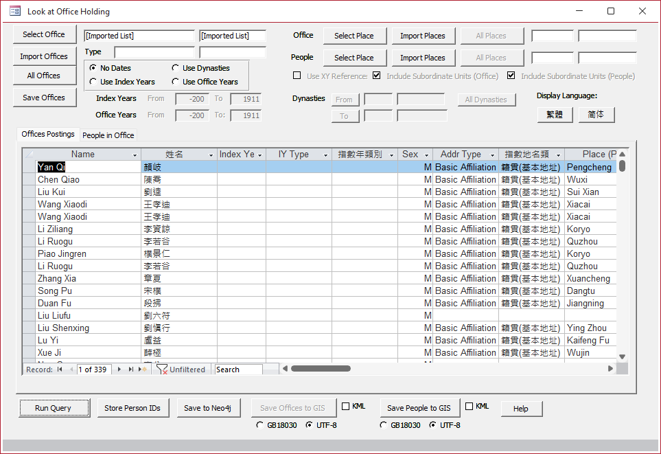

were made. It turns out that this option is most useful for the Ming, where data on years for
office postings is more abundant. Without limiting the years, CBDB finds 411 postings for:

Adding the filter limits the results to the years 1400-1500 to 33 postings:
If one wishes to look at people who held office at a particular place or places, the form allows
the user to select a place through the procedures discussed above. One can select a single

place, use a filter for name, or import a list of address IDs. Then one runs the query in the
usual way. Below is a query about the people who served in prefectural offices in Wuzhou 婺
州 during the Song dynasty.

One can also explore where people from a particular place (or list of places) held particular
types of office. Below is a query about where people from Kaifeng held prefectural office

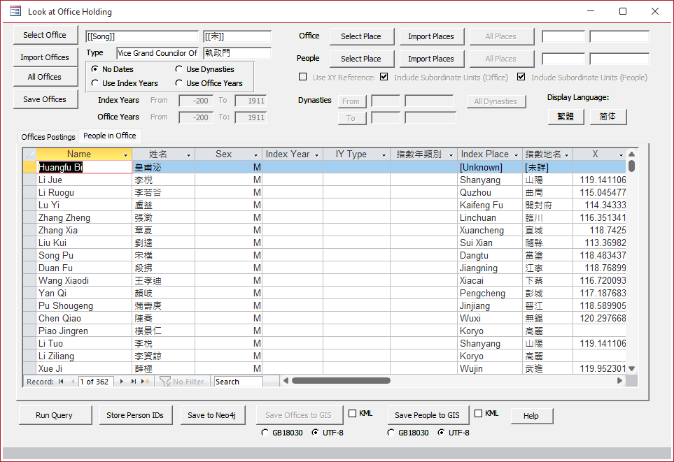

during the Song dynasty.
And one can combine the two restrictions and explore who from Kaifeng served in prefectural
office in Wuzhou during the Song:

Exporting to GIS

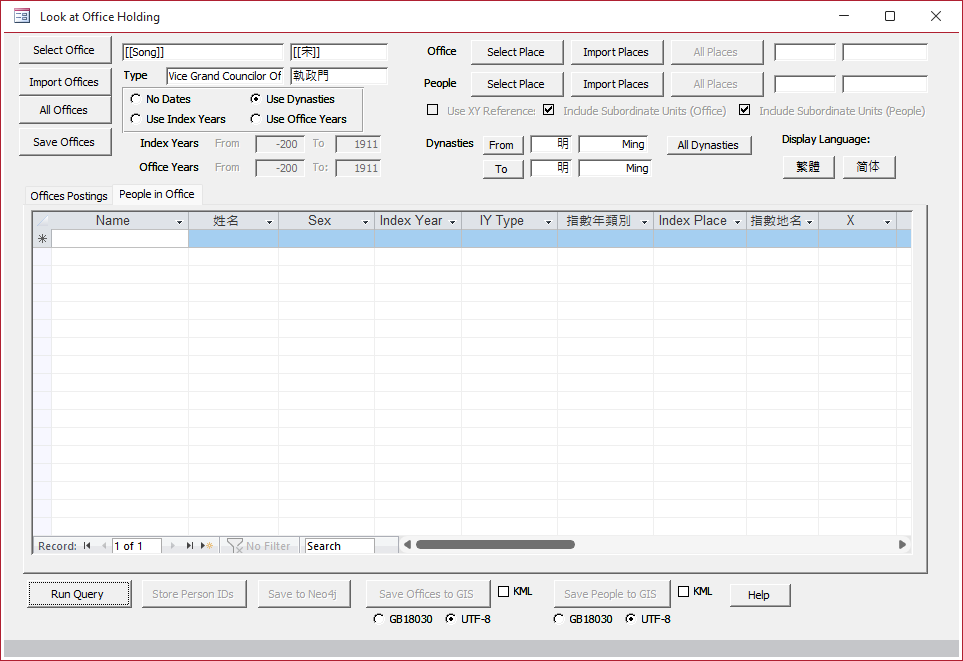

Because one might want to look at the spatial distribution of either the postings or the people
who held the posts, the LookAtOffice form provides ways to save both to files that can be
read by GIS software. One can specify either UTF-8 or GB18030 encoding at the bottom left
of the form:
Note that if the results do not have any place information with X-Y coordinates, then one
cannot save information to a GIS file. For example, the office records for Vice Grand-

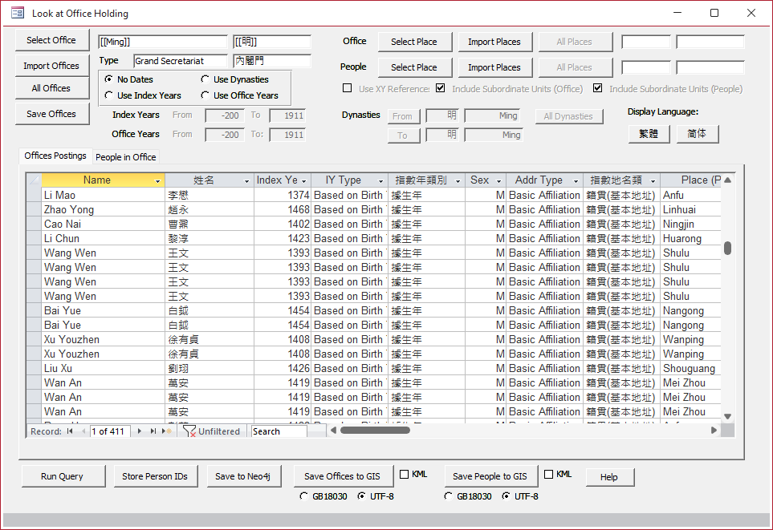

Counselor Offices does not have any coordinates associated with them because the office
location is simply “Song Dynasty.”
As in all othr forms, one can save the results to a set of CSV (comma-separated values)
files for use with Neo4j.
The table “Office Postings” has 30 fields:
Person Name (pinyin)

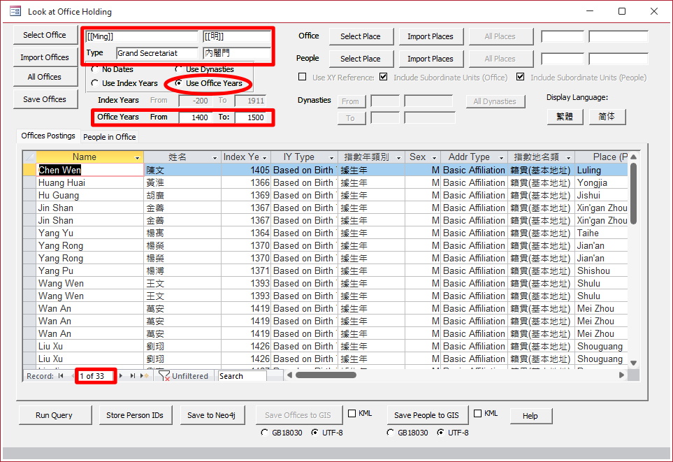

Person Name (Chinese)
Index Year
Sex (M or F)
Person Index Address Type (English)
Person Index Address Type (Chinese)
Person Index Address (pinyin)

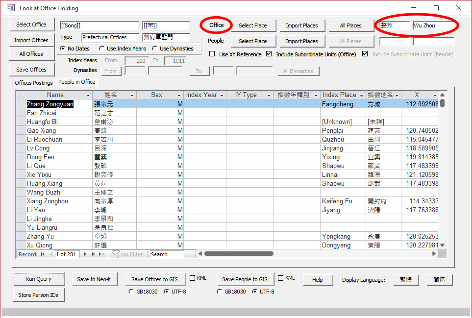

Person Index Address (Chinese)
X coordinate of Person Index Address
Y coordinate of Person Index Address
Office (translation)
Office (Chinese)

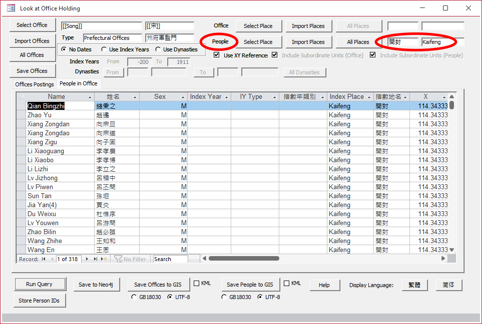

First year of appointment
Last year of appointment
Dynasty (Pinyin) (useful in cases where the years are very uncertain)
Dynasty (Chinese)
Office Address (pinyin)
Office Address (Chinese)

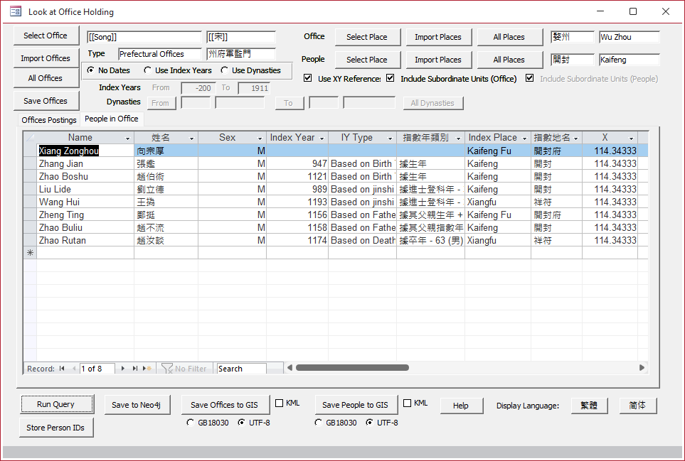

X coordinate of Office Address
Y coordinate of Office Address
XY count (number of postings) for the Office Address
Notes
Person ID
Posting ID

Office Code
Appointment type (regular, provisional, etc.)
Information on assumption of office (accepted, declined, etc.)
Office Address ID
Person Address ID
Dynasty Code
The table “People in Office” contains the usual information about people:
Person ID
Person Name (pinyin)
Person Name (Chinese)
Index Year
Sex
Dynasty (Pinyin)
Dynasty (Chinese)
Index Address ID
Index Address (pinyin)
Index Address (Chinese)
X coordinate of Index Address
Y coordinate of Index Address
Index Address Type (English)
Index Address Type (Chinese)
XY count (number of people) for the Index Address

### F. Using the Form “Query Kinship”

Queries involving kinship are more complex than queries examining categories of association
or modes of attaining eligibility for office. Since the information on kinship for an individual
usually contains just a few records, CBDB begins with those records and then looks at the
kinship information available for all the kin listed for the initial person. CBDB repeats this
search for the kin, the kin of the kin, the kin of the kin of the kin, and so on, until specified
criteria are met. First is simply a limit to the number of search iterations to allow. Usually
5000 loops are adequate. Second are limits on the distance of the kinship relations being
examined:
Max. Ancestor Gen. specifies how many generations of ancestors to include. One’s
father’s generation is 1; the grandfather is 2, great-grandfather 3, and so on.
Max. Descend. Gen. specifies how many generations of descendants to include.
One’s children’s generation is 1, grandchildren 2, great-grandchildren 3, and so
on.
Max. Collateral Kin limits how many horizontal moves are allowed. For example,
one’s wife’s sister has one unit of “marriage” distance and one unit of
“collateral” distance. One’s wife’s sister’s husband’s brother has two units of

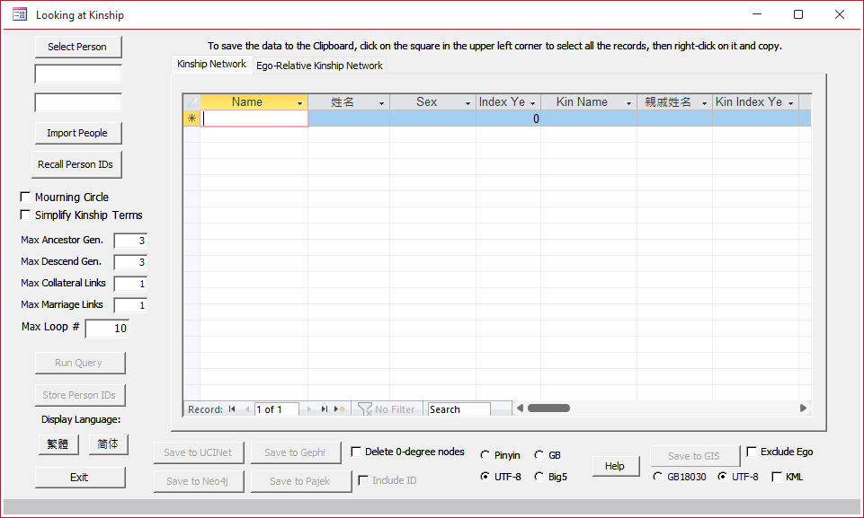

“marriage” distance and two units of “collateral” distance.
Max. Marriage Dist. limits how many links defined by marriage are allowed in the
search. One’s wife’s sister’s husband has two units of “marriage” distance.
To visualize these distinctions, consider the partial kinship network:
For Huang Tingjian, the squares and ovals with thick lines show direct lineal descent (fathers
and mothers, sons and daughters). The double lines are marriage links. All other single lines
Huang Tingjian
Huang Shu
Huang Shi
Huang Maozong
Ms. Li
Li Dong
Li Bu
Huang Yu
Huang Lian
Huang Xiang
Huang Ran

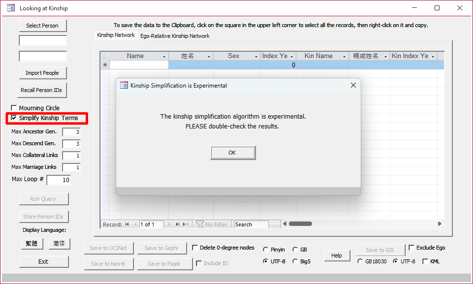

Ms. Huang
Du Shenlao
Li Cui
Ms. Huang
Yu Hong

Huang Shuda

mark collateral relations. In the measurement system used in LookAtKinship:

Huang Yu 黃育
is FFBS
(Up = 2, Down = 1, Collateral = 1)
Yu Hong 余宏
is FFBSDH (Up = 2, Down = 2, Collateral = 1, Marr. = 1)
Li Cui 李萃
is MB

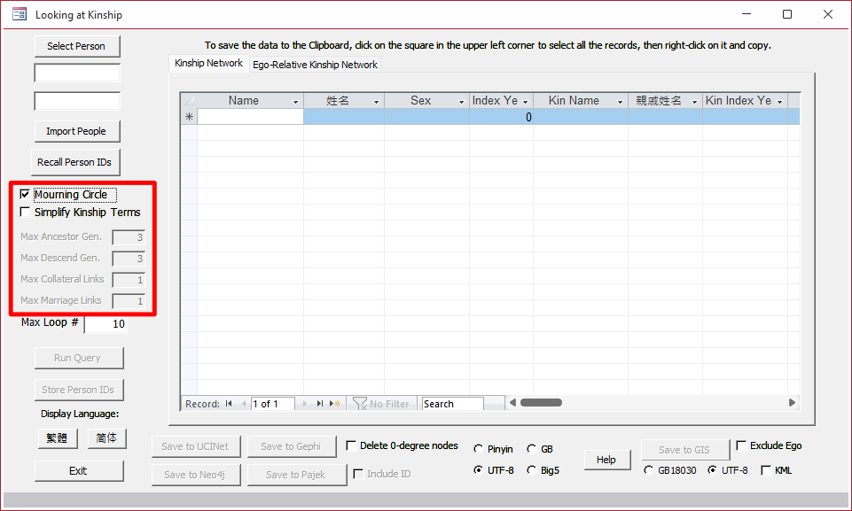

(Up = 1, Collateral = 1, Marr. = 1)
Du Shenlao 杜莘老 is SDH
(Down = 2, Marr. = 1)
Because LookAtNetwork keeps looking through a very large table of kinship relations until the
distance limits are reached, the kinship table produced by the search can grow very large.
Therefore please note:
WARNING: searching for extended degrees of collateral and marriage
distance may result in a very large dataset
Please note that when one searches, CBDB automatically simplifies a small group of relations
created by concatenating relationships through iterative searches (B = Brother; D = Daughter;
S = Son; Z = Sister):
BB  B
BZ  Z
ZB  B
ZZ  Z
SB  S
SZ  D

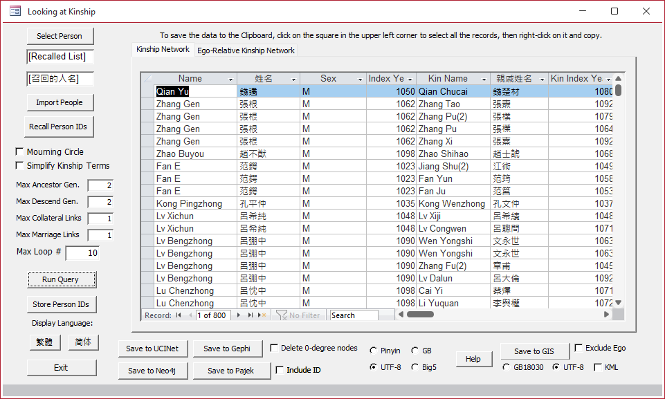

DB  S
DZ  D
These simplifications reduce the collateral distance by 1.
CBDB also provides a more experimental option for simplifying concatenated kinship terms
that the user should use with caution. The user can activate a CBDB kinship simplification
algorithm by clicking on the Simplify Kinship Terms check box. (Appendix D lists the
kinship terms simplified by the CBDB algorithm.) When one clicks on this option, CBDB
warns that this approach should be double-checked:

Another standard concern in Chinese kinship studies is to examine the so-called “mourning
circle” defined by five degrees of kinship relation. LookAtKinship allows one to simply click
on the “Mourning Circle” check-box to reconstruct what is known in the database about kin
who are part of an individual’s mourning circle. When one selects “Mourning circle,”
however, the four limit parameters are preset and therefore deactivated.
To examine kinship relations, one first selects the person or group of people whose kinship
networks one seeks to explore. There are three different ways to select people. First is to
recall an individual person (from the Browser) or group of people stored in the database as

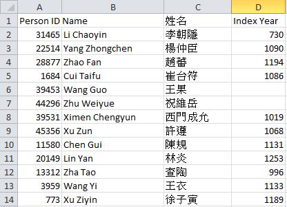

the result of an earlier query (see LookAtEntry for an example of storing the list). If the

“Recall Person IDs” button is enabled, this means that there is a person ID or group of IDs

created earlier that can be used now.
When one clicks on “Recall Person IDs,” the form either loads the person (if there is just one
ID) or the list of ID (and displays “[Recalled List]”) in the box for the selected person’s name.
One then sets the desired parameters and runs the query.
The second approach is through importing a list of people sharing common
characteristics identified by other queries. For example, one could start with people in the
Song dynasty who became eligible for office through a legal examination. One copies the
results of the LookAtEntry query to a Word or Excel file, edits the results, and copies the
person IDs to a text file.
Note that this is a change from earlier versions of the program. The text file
should contain nothing more than a list of person IDs and needs to be in ANSI
text formatting.

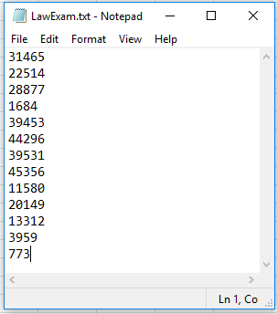

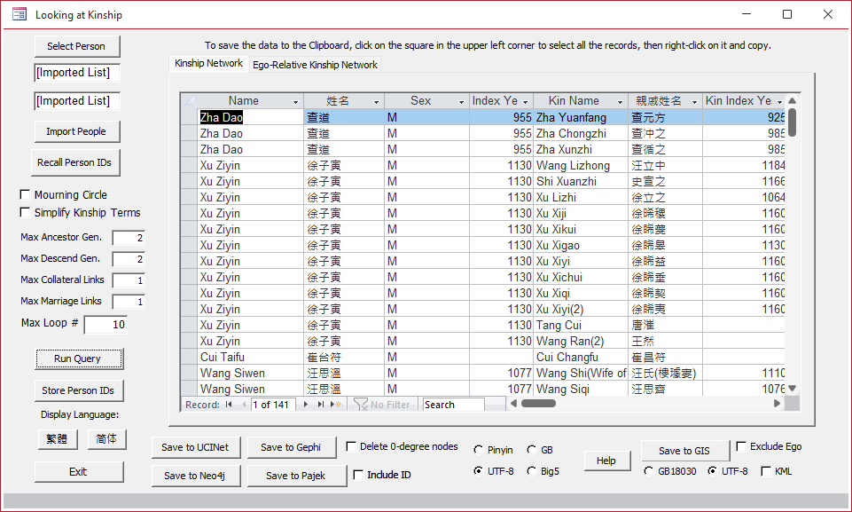

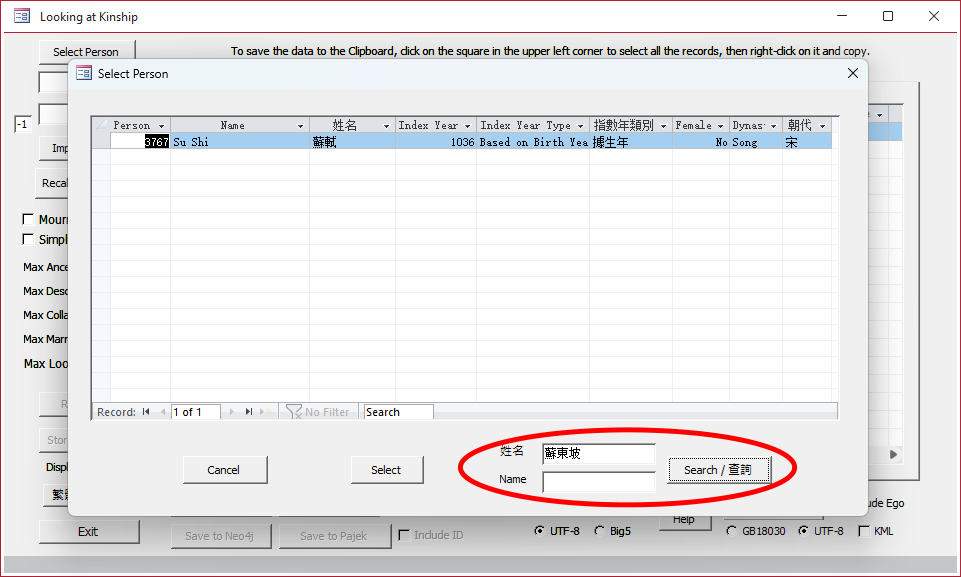

After one clicks on the Import People command button, selects the file, and
LookAtKinship successfully reads the file, the form will look like:
One then sets the desired parameters and runs the query.
The third approach is the simplest and most direct: one clicks on the “Select Person”
command button on the top left corner, which will open a search form. One can search for a
person using either Chinese characters or pinyin. As in the Browser search function, the form
looks not only at formal names (姓名) but also all the alternative names used for people. Thus,
if one enters Su Dongpo 蘇東坡, the form will correctly locate the record for Su Shu 蘇軾.

Once one has selected the person, one sets the search limits (or chooses the Mourning Circle)
and clicks the Run Query command button to start the search.
When the search finishes, there are two tables one can examine. The first, Kinship
Network, lists all the kinship relations discovered through the search:
This table has 27 columns:
Name (pinyin)
Kin Name (Chinese)
Name (Chinese)

Index Year of Kin
Kin Name (pinyin)
Sex of Kin
Kinship Relation
Index Address Type (Chinese)
Index Address of Person (pinyin)
Address Type of Kin Index Address
Index Address of Person (Chinese)
Address Type of Kin Index Address (Chinese)
X-Coordinate
Distance (great-circle distance between the addresses)
Y-Coordinate
Person ID
Index Address of Kin (pinyin)
Kin ID
Index Address of Kin (Chinese)
Index Year Type (English)

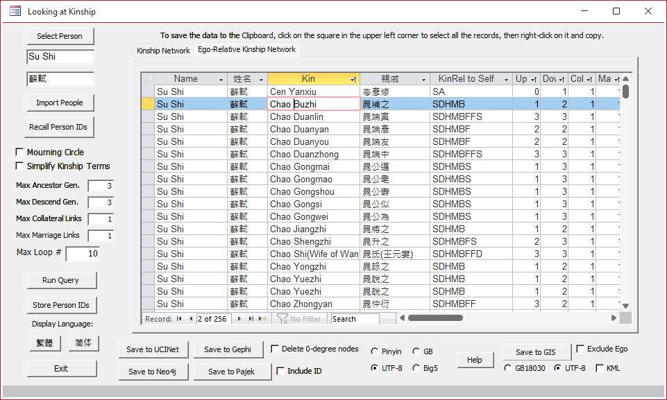

X-Coordinate of Kin Index Address
Index Year Type (Chinese)
Y-Coordinate of Kin Index Address
Kin Index Year Type (English)
Notes
Kin Index Year Type (Chinese)
Index Address Type
The second table, Ego-Relative Kinship, describes the kinship relation between each person
in the first table and the person selected at the very beginning:

For example, Chao Buzhi 晁補之 is Su Shi’s third son’s second daughter’s husband’s mother’s
brother (S3D2HMB) with a metric of {1,2,1,1}. The path one traverses to reach Chao
Buzhi’s younger brother Chao Jiangzhi 晁將之 is first to locate Chao Buzhi and then find all
of Chao Buzhi’s brothers. Their metrics would then be that of Chao Buzhi, {1,2,1,1} + one
more collateral step, for the result {1,2,2,1}, which would exceed the search parameter for
collateral distance, set to just 1. However, the search algorithm automatically reduces BB (in
S3D2HMB+B) to B, since they, as Chao Buzhi’s brothers, are also brothers to the husband’s

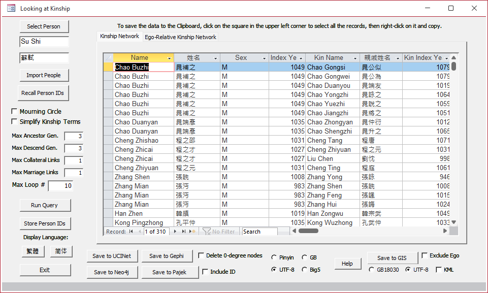

mother. They then fall within the 1 collateral link distance and are included in the search
results. (The “Ego-Relative Kinship” table has an additional column that gives a raw path that
shows how CBDB simplified the kinship relations, but, as explained above, CBDB simplifies
only the simplest relations (e.g., BZ  Z). More complex simplifications require
correspondingly complex algorithm that CBDB does not implement.)
As is true for all the other tables in all the other forms, if one clicks on the upper left
corner of either table in this form, one can select all the records in the table, which then can be
cut and pasted into other programs. Also, right-clicking on any of the column headings allows
one to sort on that column.
Finally, one can export the kinship data to four different types of files. The first three
are different formats of Social Network Analysis (SNA) files: UCINet (1), Gephi (2), and
Pajek (3) with various character code options and the option to include ID in the labels. For
Gephi and UCINet, the program can also remove zero-degree nodes, those nodes without
connections to any other nodes. (This sometimes occurs when one imports a list of people to
search for, and some of those people have no kinship information in CBDB.) The fourth type
of file is for GIS visualization: the program can save the file as a file readable GIS software (4)
or in KML format with two different code options. The output includes the xy_count field,
which is the count of the number of people associated with a particular set of coordinates. This field is very
useful as a parameter for displaying results in GIS software. Note that the form allows one to
exclude the ego-records in the GIS output. When one has searched for the kinship network of a

single, selected person, checking this box just removes the selected person from the output
with little impact on the results. However, if one looks for the kinship networks of a list of
people, including the people on the list can distort the data, and especially the xy_count, and it
may prove useful to filter those people out of the GIS data and focus only on their kin.
The default display for both nodes and edges in the Pajek output files uses color-coding to
indicate degree of distance from the target person:
Black
= the target node;
Blue
= nodes at a summed kinship distance of 1
Green = nodes at a summed kinship distance of 2
Orange = nodes at a summed kinship distance of 3
Yellow = nodes at a summed kinship distance of 4
Red
= nodes at a summed kinship distance of 5 or more

1
2
3
4

### G. Using the Form “Query Social Networks”

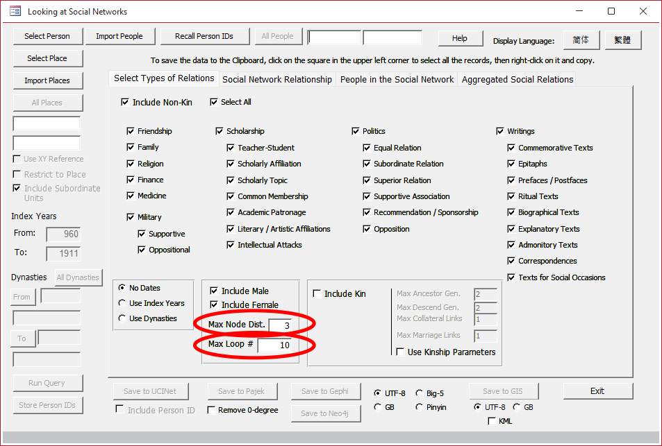

LookAtNetworks is the most powerful querying interface developed for the Access version
of CBDB. It allows the user to explore social networks defined both by kinship ties and by
other forms of social relations. It allows the user to select a person or to import a list of people
produced by other queries. It similarly allows the user to start with a place or to import a list
of places. LookAtNetworks allows the user to select the particular forms of social association
to investigate, and it allows one to set the range of years to consider. As in LookAtKinship,
the queries in LookAtNetwork are iterative: the query produces an initial group of people
and then looks at the relevant connections between these people and others in the database.
Each cycle adds more people, whose associations then produce yet more people.
LookAtKinship has five metrics to limit the search, but LookAtNetworks has just two: a
maximum loop count (how many times the query iterates through the list of people), and a
maximum node distance. This distance is the number of links between a person in the network

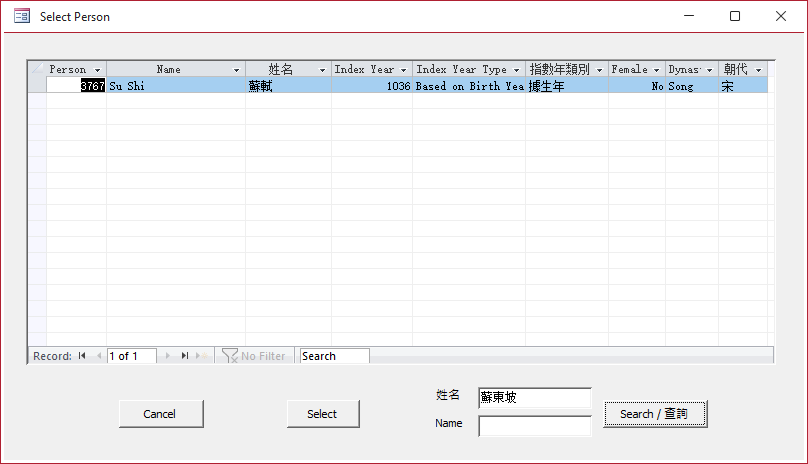

and members of the group of people identified by the first step in the search process. If the
user selects a particular person, then all distances are measured from that person. If one starts
with a list of people, then all the people on that list serve as starting points. If one starts with a
place or list of places, then the people initially identified as associated with that place or those
places serve as the starting points.
WARNING: Higher node distances may result in a very large dataset
NOTE: A query set at a node distance of 1 will result in a) all the people associated with the
selected person(s) and b) all the associations between the people in the network. This
particular kind of network is called an ego network: it is important because it sometimes
reveals that even within the network of one person there were rival networks. One can sort

these relationships in the query results table, and one can delete any records one does not wish

to export for further analysis.
Basic Query Functions
Running a query begins with selecting the elements to investigate.
1. Begin with People
A. Select a Person
If one wants to look at the social networks which link a particular person to others, one can
click on the Select Person command button to open a form for searching for a person:
As in the Browser and the Query Kinship form, one can use courtesy names, style names
and all other forms of names to locate a person.
B. Import a List of People
A second, very useful way to consider social networks is to import a group of people
sharing common characteristics identified by other queries. For example, one could start
with people in the Song dynasty who became eligible for office through a legal

examination. One copies the results of the LookAtEntry query to a Word or Excel file,
edits the results, and copies the person IDs to a text file.
Note that this is a change from earlier versions of the program. The text file
should contain nothing more than a list of person IDs and needs to be in ANSI
text formatting.

After one clicks on the Import People(1) command button, selects the file, and
LookAtNetworks successfully reads the file, the form will look like:
The two boxes that give the person’s name (2) will state “[Imported List] and [輸入的人
名].”
C. Recall a Person or a Group of People from a Previous Stored Search Result
The third way to select people for analysis is to recall either a single ID that was stored
from the Browser or a list of IDs saved from a previous query. One simply clicks on the

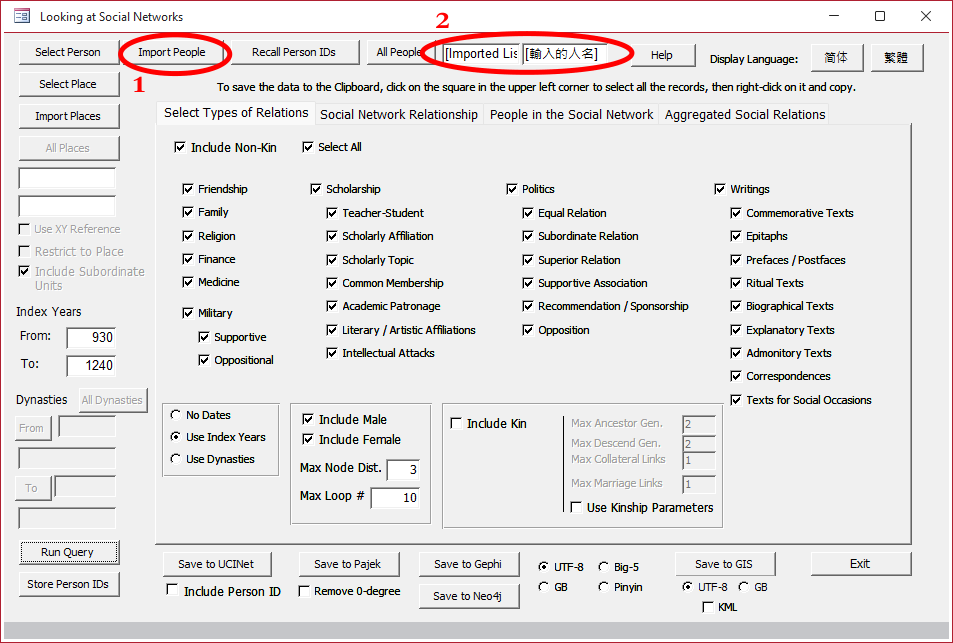

Recall Person IDs (3: next page) command button. If there is just one saved ID, the
form displays the person’s name. If one recalls a list of IDs, the form displays “[Recalled
List]” and “[召回的人名]” instead of a person’s name (4: next page):

1
2

2. Begin with Place

A. Select a Place
When one clicks on the Select Place command button, one opens a form to allow one to

select a particular place. As described in the section on LookAtEntry, , the form provides

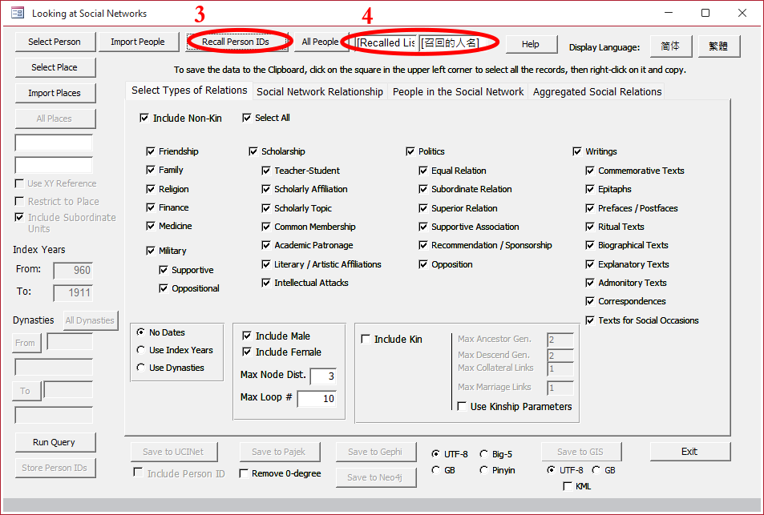

a Filter function to select a group of addresses all beginning with a specified word or
phrase.

4
3

B. Import a List of Places
Sometimes it is more useful to work with a set of Address IDs to precisely define the area
for which one wants to study the social networks. Importing a list of Address ID works the
same way as importing Person IDs.
Unless one clicks the Restrict to Place check box, the selection of a place or list of
places only influences the first step of locating an initial group of people around whom to build
a social network. After the first round of locating people with a connection to the specified

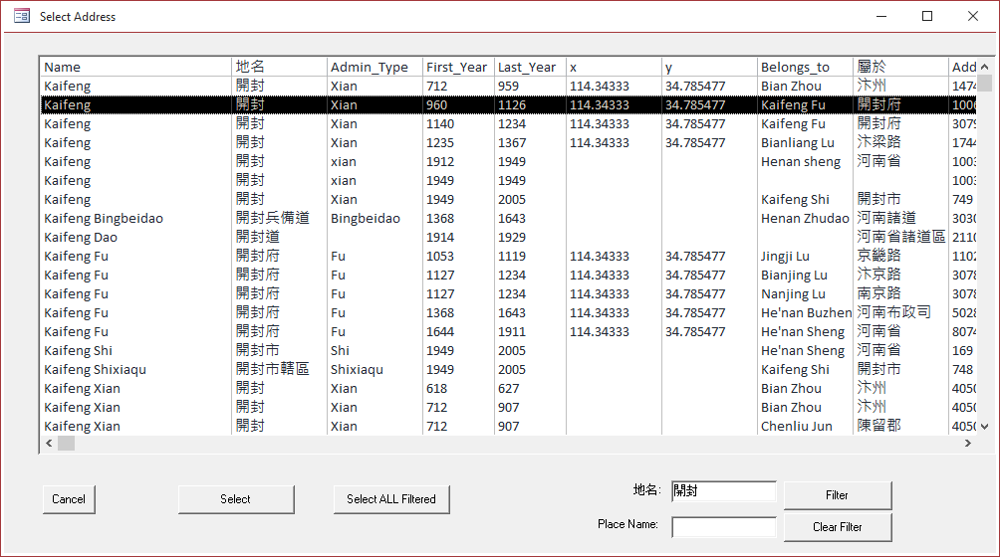

place(s), CBDB searches for the sorts of associations selected as the next part of the query
process.
If one uses both people and place as the starting point for a query, CBDB looks for
people from the specified place who had connections to the selected person or group of
people that matched the categories of association specified for the search.
C. Use XY Reference
As in the other forms, CBDB allows the one to use the longitude and latitude of the
place(s) one has selected to identify other relevant administrative units for the specified
time period. One clicks on the Use XY Reference check box to activate this feature.
3. Determine the Time Period
This is straight-forward: simply fill in the beginning and ending years for the index years of
people to be considered for the search.
4. Select the Node Distance

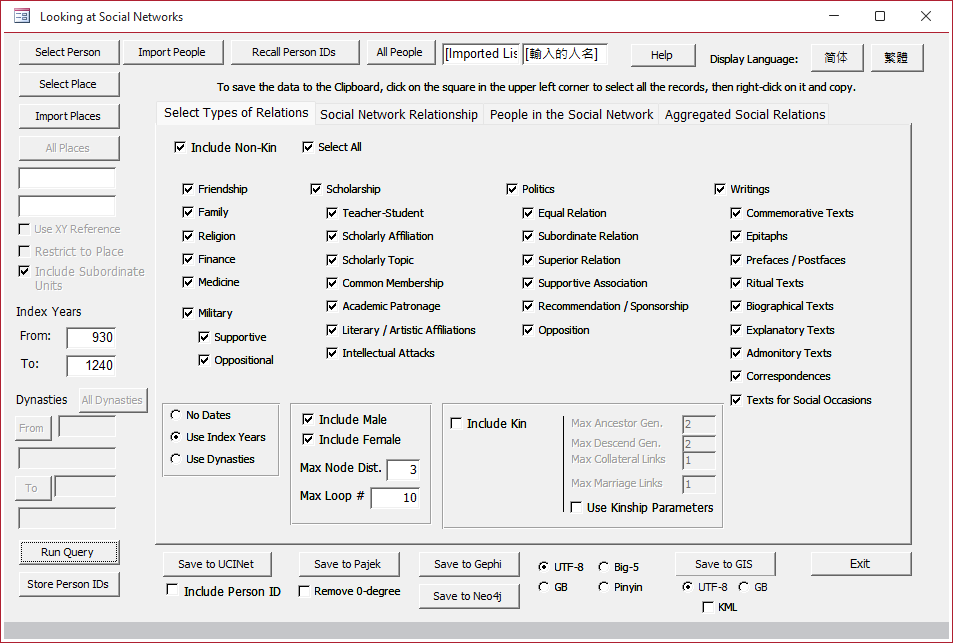

One needs to be careful: the number of people found by the search procedure can grow
exponentially with the increase in node distance. It is a good practice to start conservatively
with a small node distance. In the example search discussed below, using the nine people
who became eligible for service through law examinations, a node distance of three
produces over 5000 relationships.
5. Set the Maximum Number of Iterations
The search procedure is slow with CBDB’s large dataset, and one might want to
experiment with a relatively small “Max Loop #.”
6. Select Kin, Non-Kin, Male and Female
The LookAtKinship form does not allow one to look at kinship relations for a group of
people imported through a list, so LookAtNetworks provides an alternative approach to
examining kinship. One selects “Kin” and de-selects “Non-Kin.” There also may be times
when one wants to eliminate associations (kinship or social) based on females, or one may

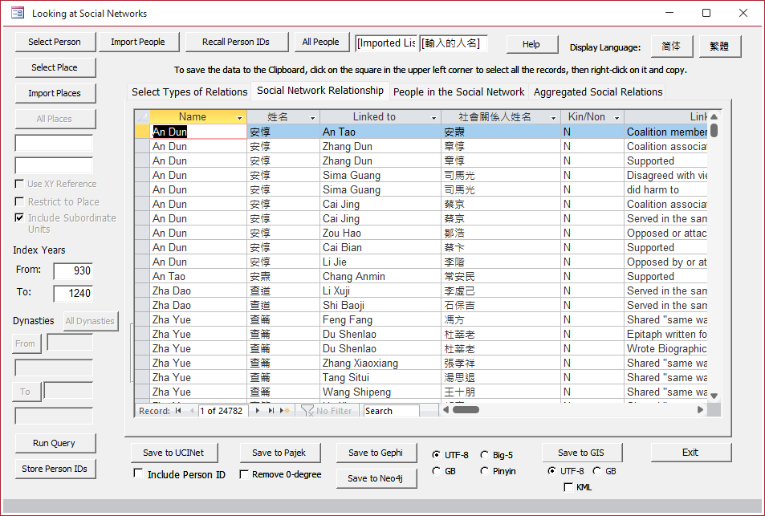

want to examine networks strictly among women. LookAtNetworks allows the user to
select these options.
7. Select Types of Non-Kinship Relations
Because there are many, many categories of non-kinship relationship, most of which are of
little importance in a particular query, one can limit the search to selected large groups of

associations. These are:
Friendship
Family
Religion
Finance
Medicine
Military

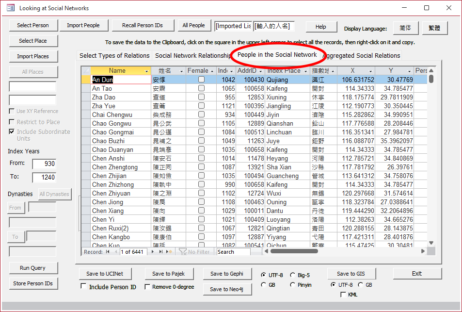

Scholarship
Politics
Writings

The last four types of non-kin associations have further selectable subdivisions. “Military”
has two, “Scholarship” seven, “Politics” six, and “Writings” nine. One can mix the types of
associations as one wishes. Once selected, these limits to the range of associations remain
active through the entire search process.
Once all of these decisions have been made, one runs the query. The example examined
below uses the list of people (A) who entered service through the law examination. The first
version selects the years 930 through 1240 (B) with a maximum node distance of 3 (C) and a
maximum loop count of 10 (D) but does not constrain either the kinship or the non-kinship
associations and allows all possible types of association.

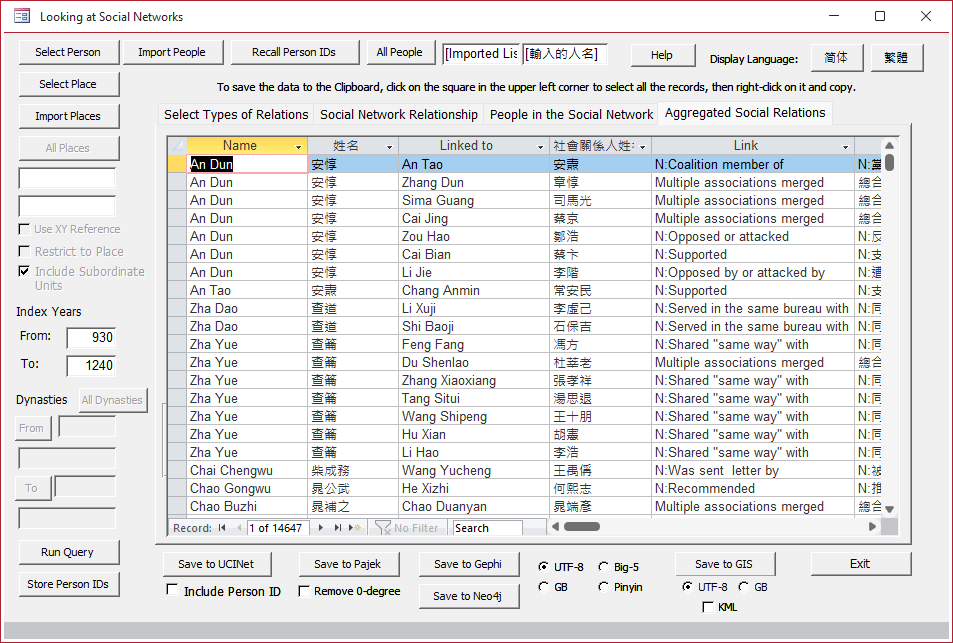

The result is a network with 6,441 people participating in 24,782 relations.

A
B
C
D

Table of Associations in the Social Network

Table of People Participating in the Social Network
Many of the pairs of people in this list have more than one relationship between them, so
CBDB also produces a table in the Aggregated Social Relations tab with just one record for
each pair of people that gives the number of relations between them:

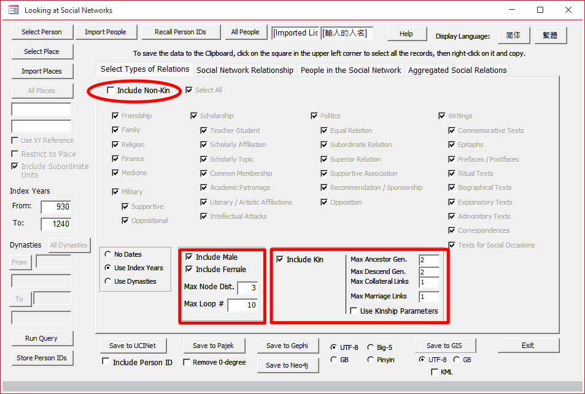

If the network is too large, one can examine more narrowly defined networks. If one looks just
at kinship relations for the group, CBDB finds 117 people linked through 144 relations (with
total node distance of 3 and constraints on the kinship distance for the relationships).
If one looks just at associations formed through writing with a maximum node distance of 2,
excludes kinship, and uses dynasty rather than index year, CBDB discovers 7,699 relations
(with 3,897 aggregated relations) among 1,379 people:

The results seem promising: not too many links, and not too few:
However, if one scrolls to the right in the table of results and right-clicks on the header of the
field called “Edge Distance” to sort the records, one will discover that only the first nine
records connect the initial group of people who became eligible for service through legal
examinations with other individuals. (These are relations with an “edge distance” of 0, i.e.,

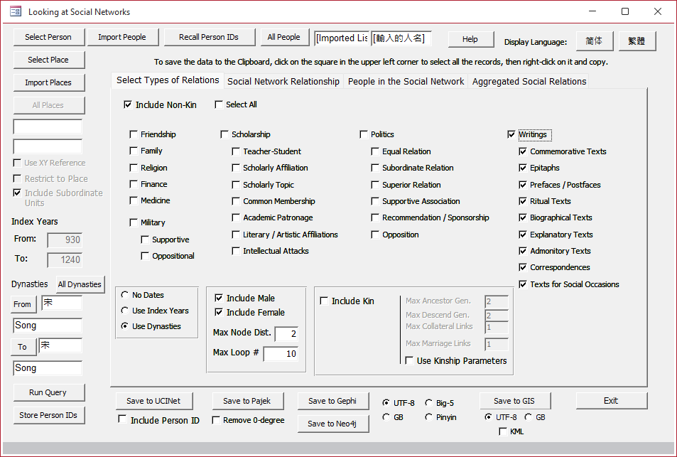

directly linked to the original list.) Only five of the initial thirteen people have any associations

defined by writings, and these links are to only seven people. Of those seven associations, five
are to people (Liu Zhi, Yang Jian, Zhu Xi, Zhang Shi, and Lou Yue) who have vast social
networks who contribute most of the relations in the social network. Thus, it perhaps is better
to return to the larger set of unrestricted relations among 3,897 people and use the tools of
social network analysis to sort through the data.
Requerying
Some users have discovered that it is useful to reuse the people identified in one query in
LookAtNetworks to serve as the basis for additional queries in the same form. For example,
the search for the kinship relations of the men who passed the law examination produced 146.
We can look to see if they wrote to one another by first clicking on the Store Person IDs
command button and then directly clicking on the Recall Person IDs command button.

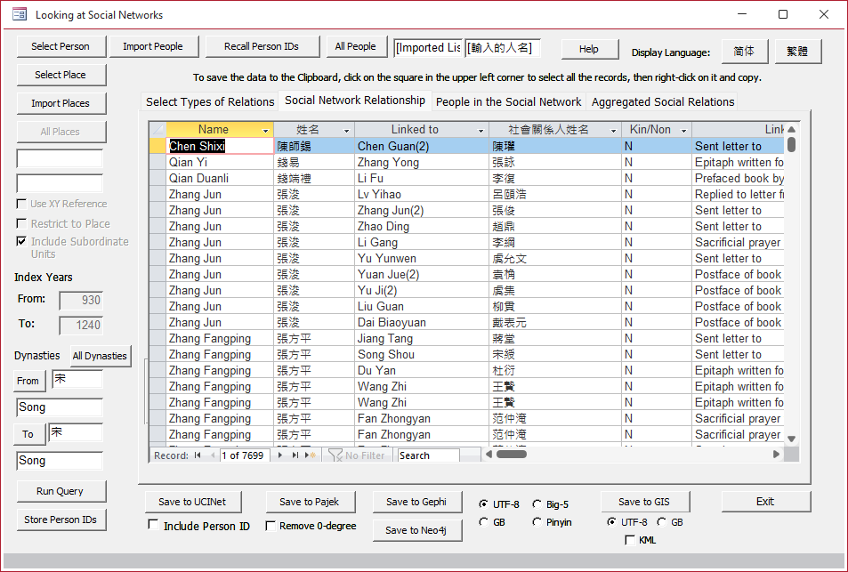

This loads the current results as a list of person IDs. One then restricts the non-kin
relationships to writing and reruns the query. This has the added virtue that the list of people
is now available for use in other forms as well.)
Outputting Results
LookAtNetworks provides ways to output the results of a query to three different SNA
programs: UCINet, Pajek, and Gephi. Because Pajek supports Chinese characters, CBDB
allows the output to Pajek to be in either of three coding systems-UTF-8, Big-5, and GB-or in
pinyin without characters. GIS software also supports Chinese characters, but how they are
handled differs depending on the regional settings of one’s computer. The default display for
both nodes and edges in the Pajek output files uses color-coding to indicate degree of distance
from the target person:
Black
= the target node
Blue
= nodes at a summed distance of 1
Green = nodes at a summed distance of 2
Orange = nodes at a summed distance of 3
Yellow = nodes at a summed distance of 4
Red
= nodes at a summed distance of 5 or more
One also can export a set of CSV (comma-separated values) files for use with Neo4j.

### H. Using the Form “Query Pair-wise Associations”

At times one wants to consider whether there were any social links between two individuals or
among members of a group of people identified through criteria other than those of kinship or
social network. One could use LookAtNetworks to generate the social network of one
person and see at what point the other person or people appear as part of the network.
However, the Access version of CBDB provides a tool to directly examine if there were any
connections without going through the general network search.

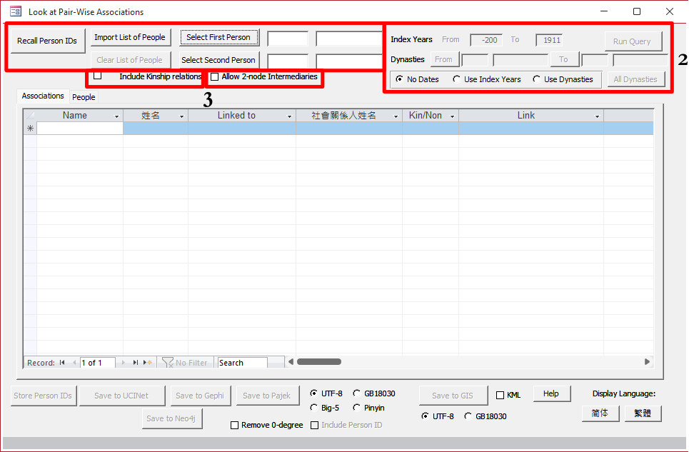

The form is simple. First one (1) either chooses two individuals or imports a list of people, or
recalls either a single person stored from the Browser [who becomes the “First Person”] or a list
of people from earlier, saved query results using the procedure described for other forms above,
then (2) the range of dynasties or index years for the people in the relations, if desired, and
finally, (3) the type of permissible relations. The options for relationships are:
1. Allow 1-node Intermediaries: That is, people who are directly linked to both (or, for
imported lists, two) of the selected people: Person A — Node1 — Person Bl . In this case
one leaves the check box for two-node intermediaries unchecked.
2. Allow 2-node Intermediaries: Here one allows people linked to one person who in turn
have links to people linked to the second person (or to another person on the imported list):
Person A — Node1 — Node2 — Person Bl. In this case one clicks on the check box for
two-node intermediaries to select the option.
3. Include Kinship relations: The default is simply to look at social (non-kinship) relations
connecting people, but kinship also can be important, and the form allows one to examine the
role of kinship relations in the social network.

1
2
3

One Node Intermediary Searches

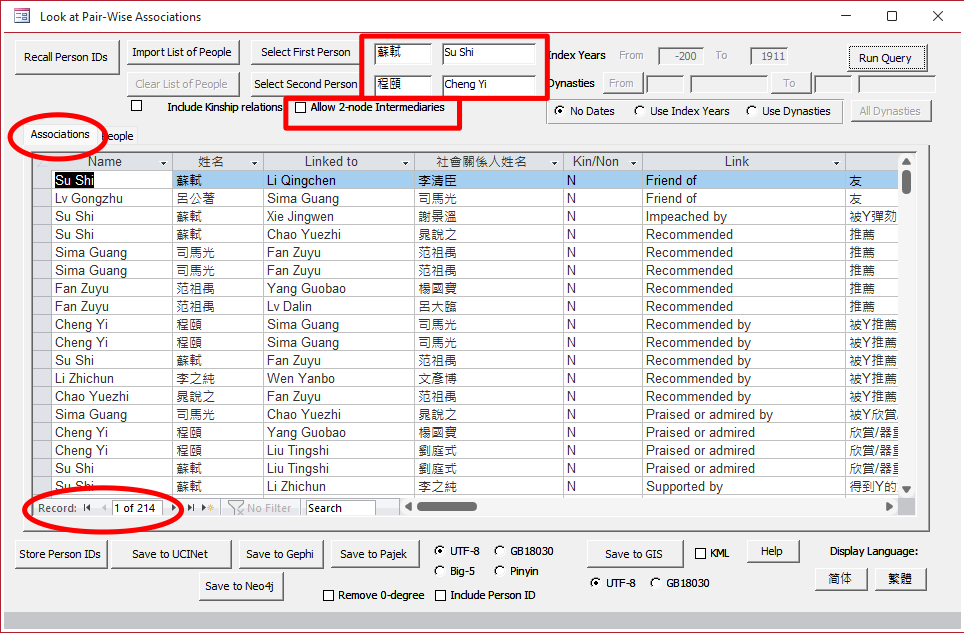

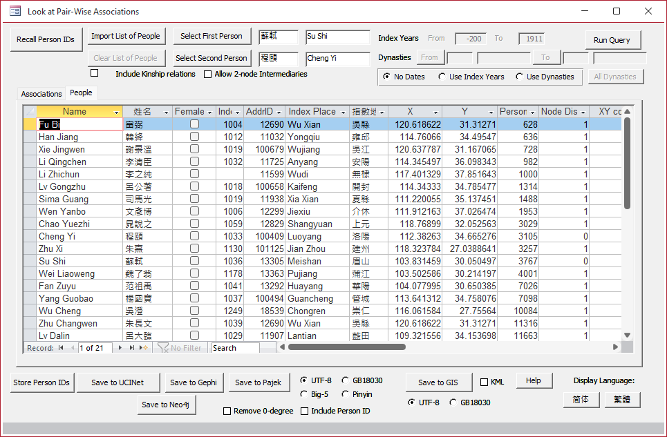

For example, if one explores the links between Su Shi 蘇軾and Cheng Yi 程頤, allowing only
people directly linked to both of them finds 214 associations among 21 people.
As in LookAtNetworks, the form provides two output tables: “Associations” for the
relationships, and another, “People in Associations,” for the people in the relations.
As with the other forms, one can save the results of a search by clicking on the grey square in
the upper left hand corner of the table to select all the records and then using Ctrl-C:

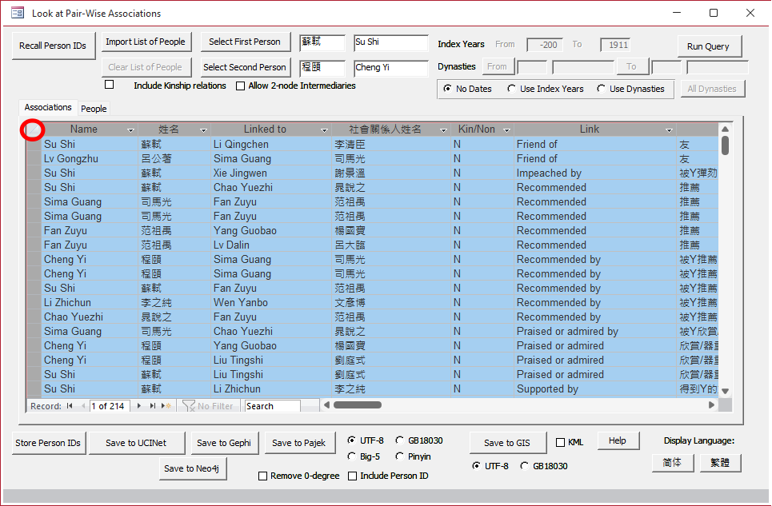

One also can sort on a column of the table by clicking on the column (in this case, “Name”) to
select it, then right-clicking to choose the type of sort:
One also can select a block of records to save by clicking the mouse on the left-hand grey
column of the first record in the block and then, with the left-click button still held down,
dragging the mouse down the grey column to the last record in the desired group:

However, note that the entry directly below the selected block includes Dai Biaoyuan 戴表元

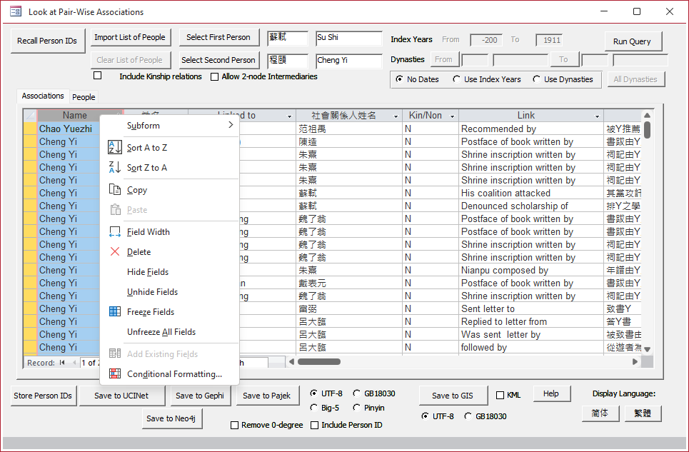

(1244-1310), a late Southern Song figure. If one wishes to narrow the search to intermediate
nodes who are roughly contemporaneous with the target people, one can use index years to
limit the search. (Using dynasty as a filter does not help.) If one limits the index years to a
range between 1000 and 1100, one finds fourteen people with 112 relations connecting them:
If one then includes kin of either Su Shi or Cheng Yi who have a social connection to the
other, then one discovers one additional connection but, in this case, no additional people:

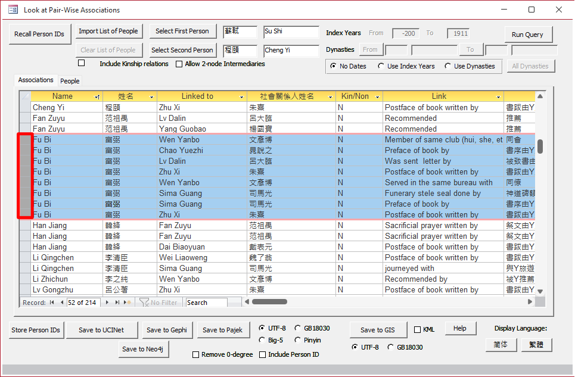

Two Node Intermediary Searches

If one broadens the search to allow two intermediary links to connect the target people, the
network becomes more complicated: The program reveals 1404 relations among 123 people
with index years between 1000 and 1100:

Searches Using Lists

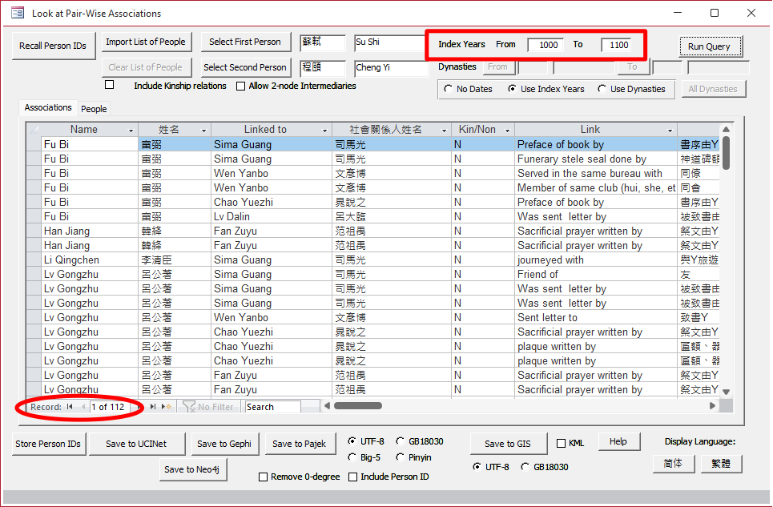

If one wants to look for connections within a larger group of people chosen by other criteria,

the form allows one to import a list of person IDs. Here one looks at Jinhua men who from
the Yuan dynasty who have extant collections. As in all lists for importing people, CBDB
requires a single column of IDs in ANSI encoding:
One clicks on the Import List of People command button and locates the file:

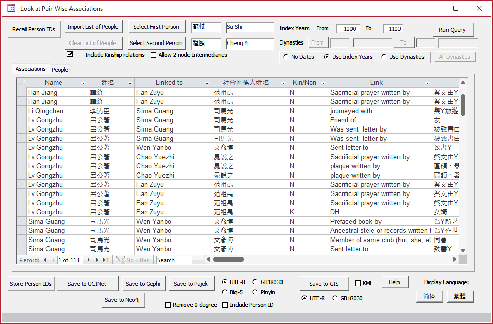

If the file is successfully read, the form indicates that the names are from an imported list. To
clear the list and return to selecting people through the two Select command buttons, simply
click on the Clear List of people command button.
Once one has imported the list, the search procedures are the same. In this case, the
query is set to look for one-node intermediaries with index years between 1200 and 1350 and
produces 1,588 associations among 187 people:

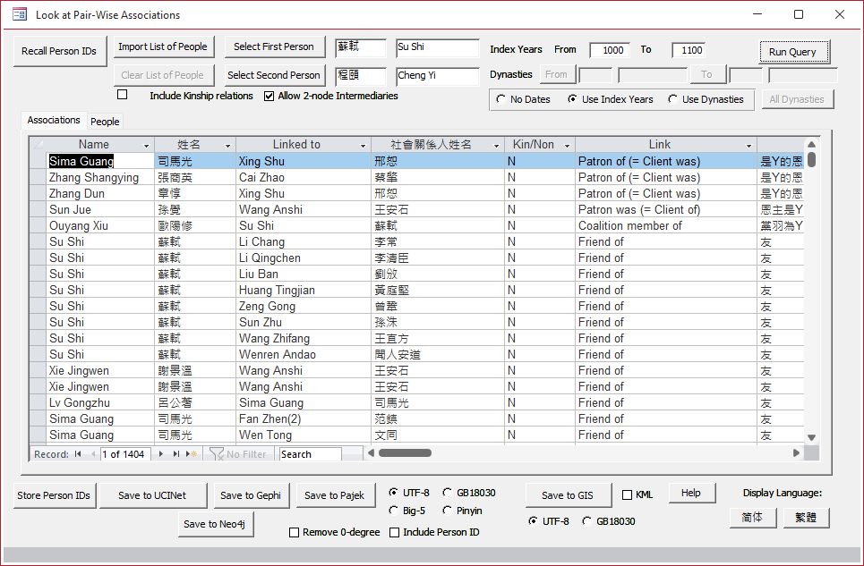

Output to SNA and GIS Programs
Like the other forms, LookAtAssociationPairs can generate files for use with Pajek and with
GIS visualization programs. The output tables for Associations and People are the same as
those in LookAtAssociations. Please consult the information in that section of the User’s
Guide.
Allowing the form to list all the relations between the 1-node and 2-node
intermediaries between Su Shi and Cheng Yi who have index years between 1050 and 1120

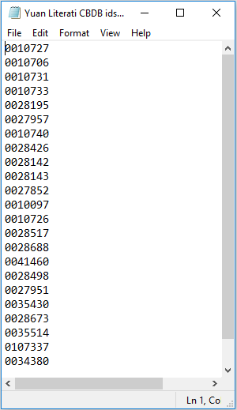

intermediaries produces a network that can be imported into Pajek.

The default display for both nodes and edges in the SNA output files uses color-coding to
indicate degree of distance from the target person and the type of connections:
Nodes
Edges
White = the target nodes;

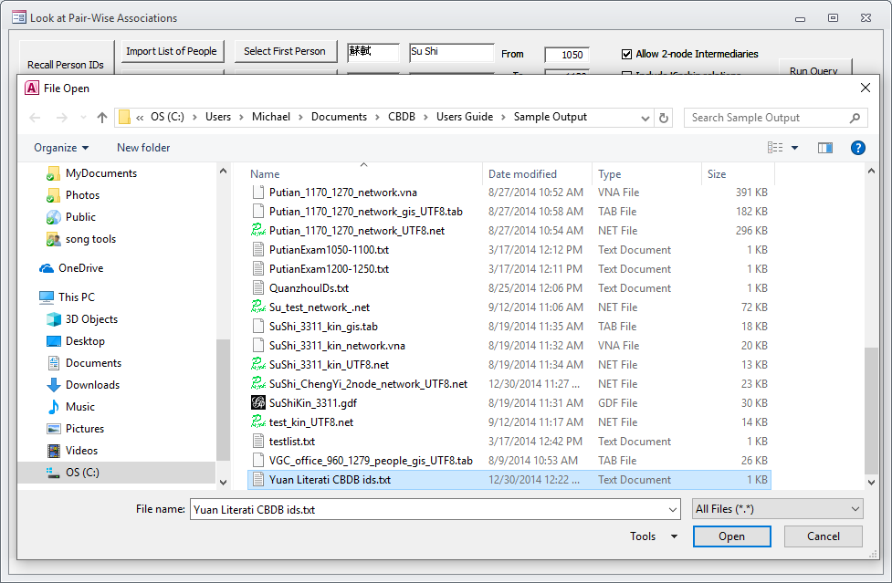

from target nodes
Blue = nodes that serve as 1-node intermediaries from 1st order to 2nd order nodes
Green = nodes that serve as 2-node intermediaries between 2nd order nodes (except for
one mysterious line to Su Shi)
The output files aggregate the associations between people, and the width of the lines reflects
the number of associations between nodes.

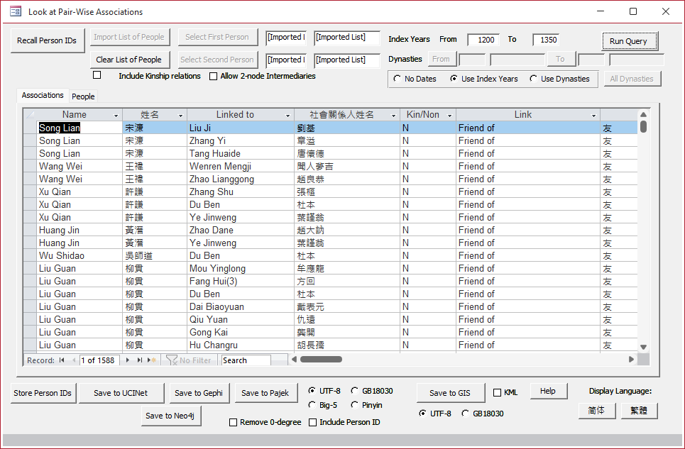

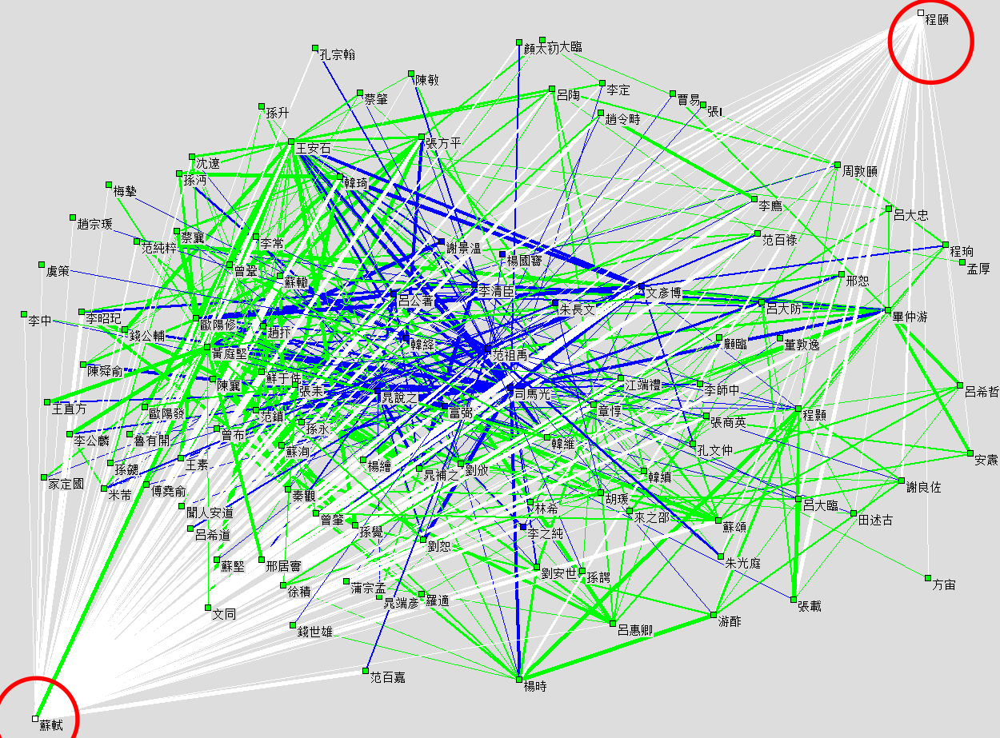

### I. Using the Form “Query Place Associations”

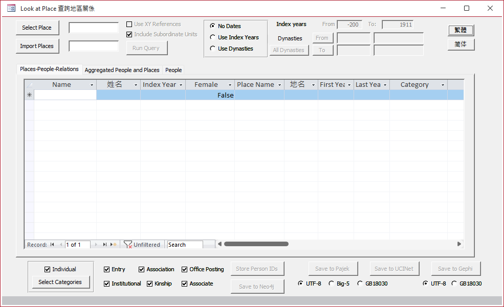

The forms discussed above produce information about the relationship between people and
places in the contexts of kinship and social relations, office holding, and entry into
government. It may be useful to see how people and place come together in a more synoptic
view. For example, one person may have been in office at a place which was the place of
registry of the kin of a friend. This sort of drawing together of connections proves difficult
without a way to aggregate information about a place over time.
Thus CBDB provides the form LookAtPlace. The form can trace seven types of relationship
to place:
1.Biographical Data: was this place the index place of the person? Did he or she move
there?

2.Entry Data: did the person take an examination at this place, or was this place
otherwise associated with the person’s entry into government service? (At present
CBDB has very little data on this type of relationship to place.)
3.Connection via Kinship: who were the kin of people from this place?
4.Connection via Association: who had associations with people from this place?
5.Place of Association: what social connections were created at this place? (At present
CBDB has very little data on this type of relationship to place.)
6.Office Posting Data: who held office at this place?
7.Institutional Connection: who were associated with social institutions at this place?
The query below looks at Jinhua for people with index years between 1100 and 1260.

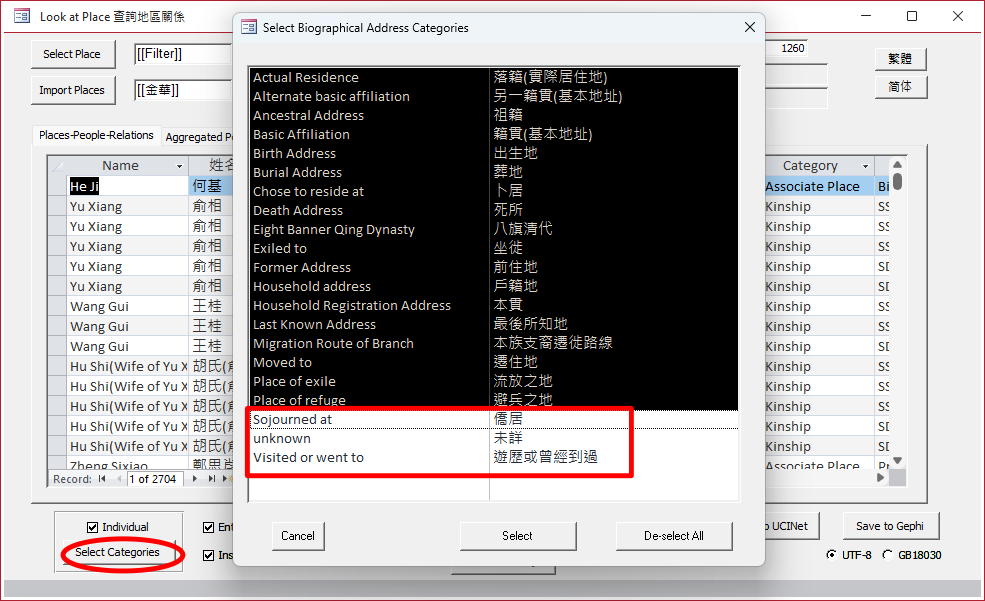

One can select which relationship to place to include in the search and can specify the usual
sorts of parameters (use of dynasty, index years and the use of XY references). As with the other
forms, one also can use a filtered list of place names or import a list of address IDs.
In addition, because the categories of relationship of people to place include that may
not be relevant to the particular query, the form allows the user to select the categories of
relationship to be used in the search:

One clicks on the Select Categories button, which opens a form. One can “Select All” and
then click on those categories to not be included, clicks on the Select button to close the form
and runs the query:
In this particular search, removing the categories eliminates just 13 records.

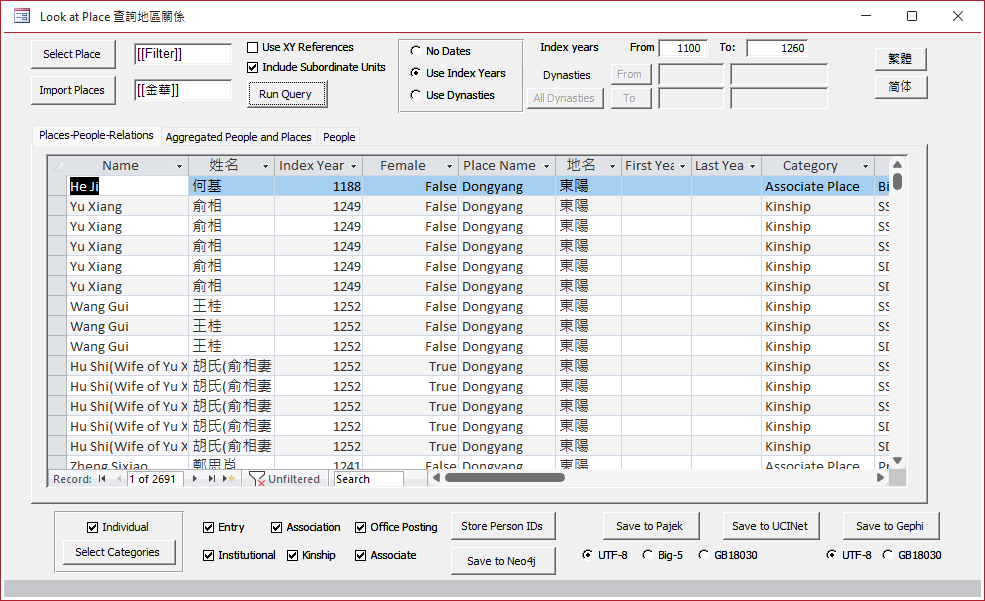

The output table has 17 fields:
1. Person name (Pinyin)
2. Person name (Chinese)
3. Index year
4. Place Name (Pinyin)
5. Place Name (Chinese)
6. Associate Name (Pinyin)
7. Associate Name (Chinese)
8. First year
9. Last year
10.Category of Place Association

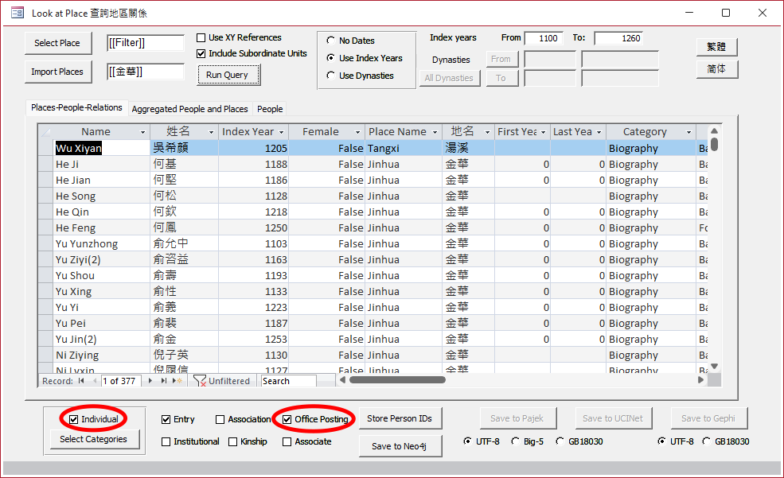

11.Relation to Place within Category (English)
12.Relation to Place within Category (Chinese)
13.X coordinate
14.Y-coordinate
15.Index Year Type (English)
16.Index Year Type (Chinese)
17.Index Year Type Code
The Category specifies which of the seven types of relations to place is recorded for the person,
while the Relation gives the specific information within the category. Thus the Category of

“Biography” indicates the person’s immediate biographical relationship to place, and the

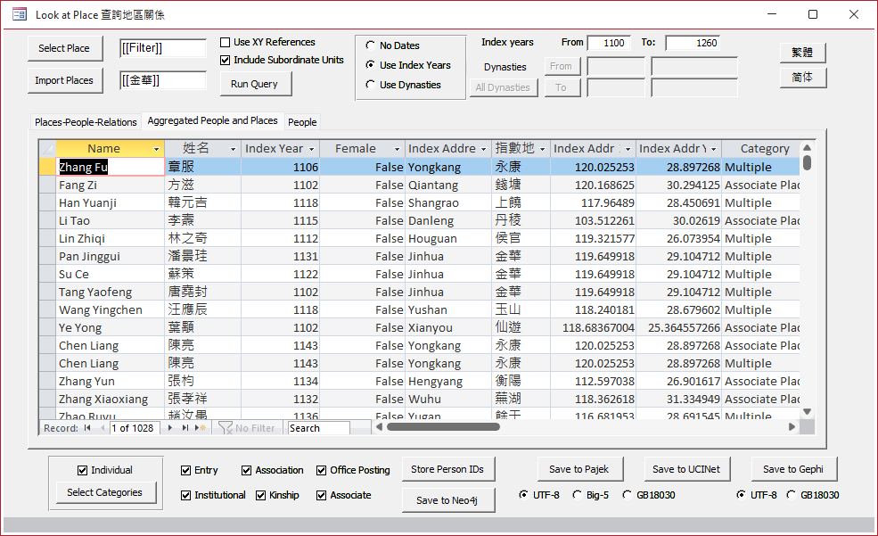

Relation provides the detail (“basic affiliation,” “moved to,” etc.). Similarly, the Category of
“Associate Place” records that the person is from the selected place, the Associate has a social
connection to the person, and Relationship provides the details of the relationship.
If one wishes to look at specific types of relationship to place, one can select the type of
relationship(s). Below is the result when one chooses Individual and Office Postings:
People may have more than one relationship to a place, and the form provides a table
that list the Aggregated People and Places relations and reveals many people with multiple

types of relationships to Jinhua:

Finally, the form provides a table that lists the people who participate in the

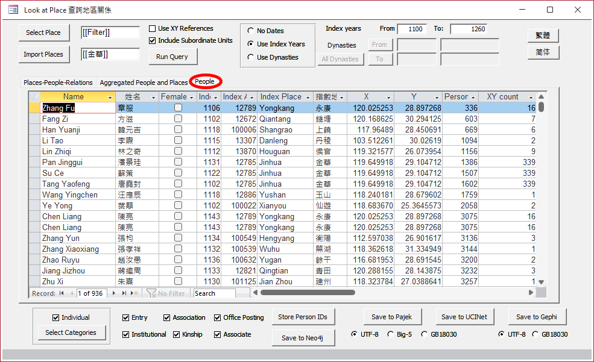

relationships:
At present, there are two ways to write the results of a search to a file:
a.The first is as SNA data in Pajek, UCINet, or Gephi format. This option is available only
when one has selected Association, Associate, or Kinship.
b.The second option is to write a series of CSV files for Neo4j. The number of files
produced through this option depends on the types of relationship to place the user has
selected.
If there is a need to save the data in GIS form, this functionality can be added in future
versions of the software.

### J. Using the Form “Query Status”

LookAtStatus is a recent addition to the forms for exploring the CBDB data. It allows users
to examine CBDB information on social distinctions recorded for members of the database.
As explained in Chapter 2, status records ways in which individuals gained reputations in
their communities. At present we have 285 codes divided into 7 categories:
Occupation
事業
Scholarship

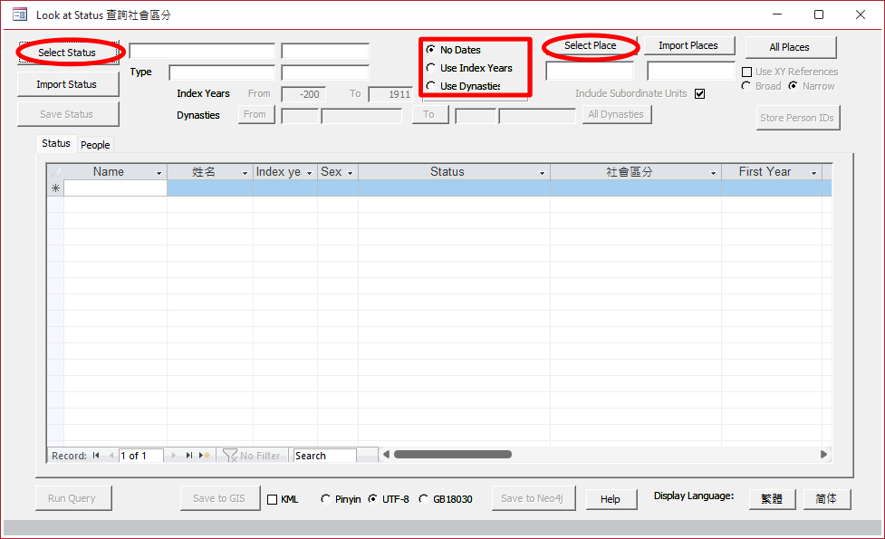

學術
Military Distinction
武功
Imperial Clan
宗社
Artistic Distinction
藝術
Religious Distinction

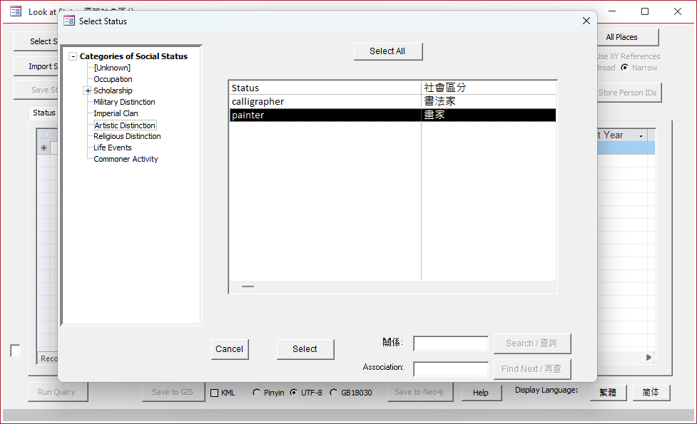

宗教
Life Events
時事
Commoner Activity
布衣事
The form shares the features of the other forms. One can filter by dynasty or index year. One
can select an index place (or group of index places) to explore. And one can store the person
IDs to use in other forms.

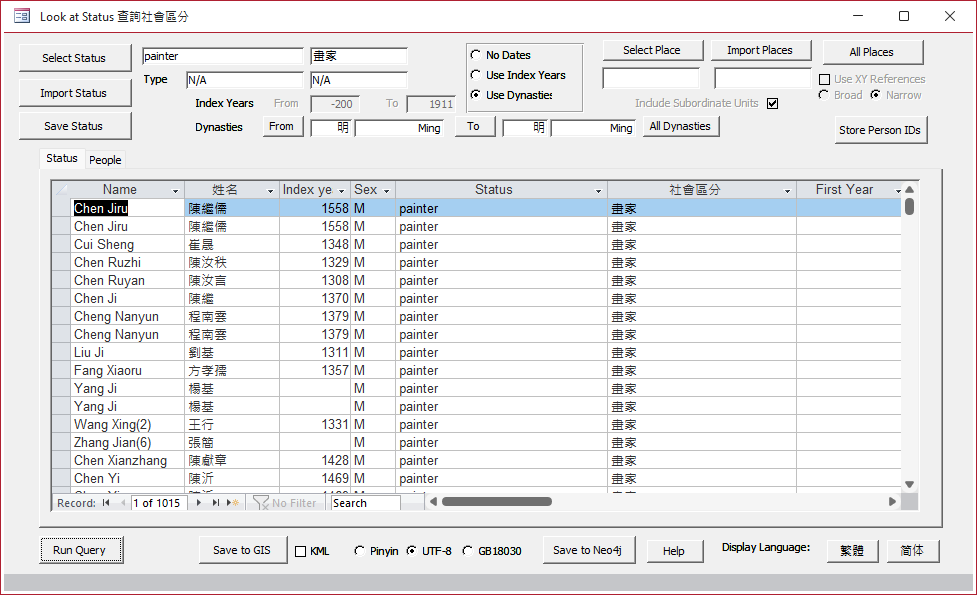

One begins by selecting the category of status one seeks to explore. Since, at present, there are
275 codes for status, the Select Status form, like the other forms, organizes the codes into
larger groups of types of status. As with the other selection forms, one can select an entire
category of status relations, or one can choose one or more specific status relations.

Below is the list of 1,015 records for social distinction through painting for individuals in the

Ming dynasty.

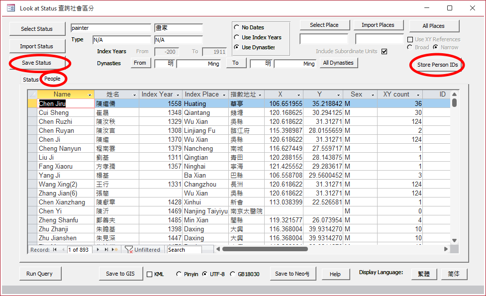

If one has selected just one type of status, in theory, the number of records in Status and
People should be the same. Note, however, that there are duplicate records in the Status table.
This is a bug that will be fixed in the next release of the data. As the People table shows, there
are only 893 individuals who have status as painters in the Ming dynasty.

One can save the IDs of the people for use in other forms by clicking on the Store Person
IDs button, and one can save the list of status codes from the query to a file for reuse later by
clicking on the Save Status button and saving the file.

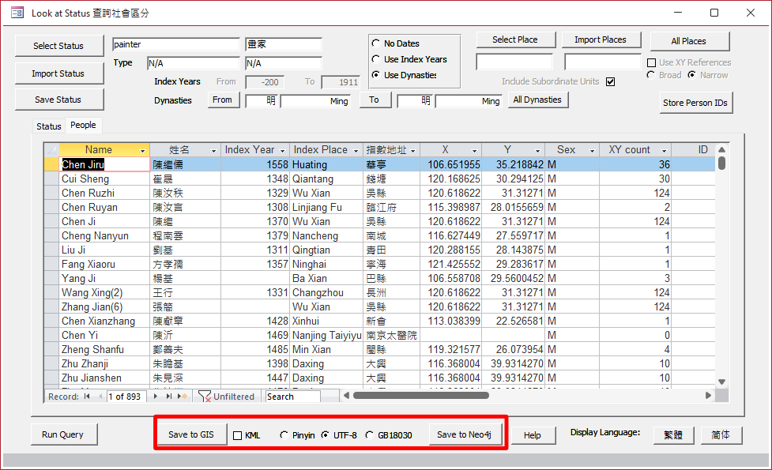

The form provides output to GIS data files as well as to Neo4j files, which capture the bipartite
person-status relationship (that is, people are connected as nodes to status types as nodes rather
than as people connected to other people).

### K. Using the Form “Query Texts and Roles”

The form LookatTextRoles enables users to investigate people who have roles in the
production of premodern Chinese texts. CBDB uses the classification of texts used in the Siku
quanshu. The roles connecting people to texts in CBDB are:
Annotator
註疏者
Author

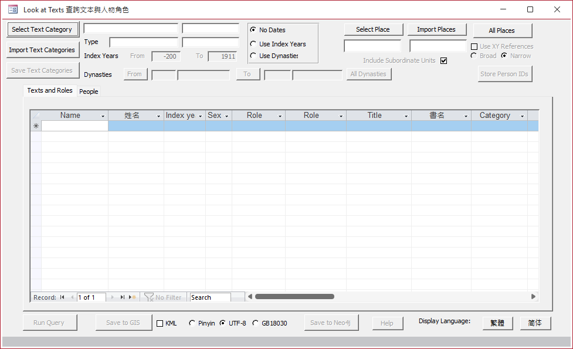

撰著者
Commentator
註釋者(含評點者)
Compiler
編纂者
Donor
捐助者

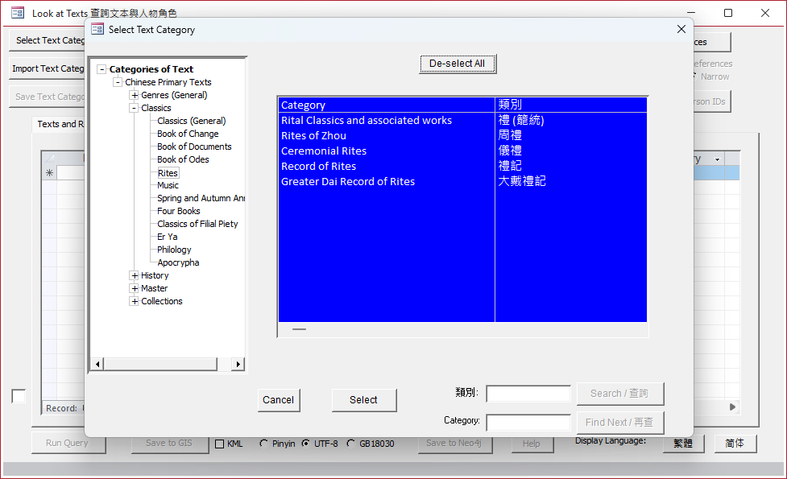

Editor
編輯者
Editorial Associate編輯助理
Proofreader
校對者
Publisher
出版者

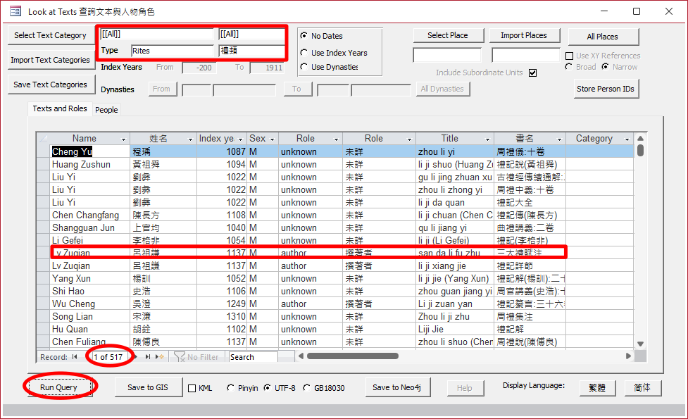

Translator
翻譯者
Work included in
收入Y 集
At present CBDB has approximately 31,000 records for people in relation to texts.
The design of LookAtTextRoles is very similar to that of other forms. It uses the
same sorts of filters: by index year, by dynasty, and by index address.

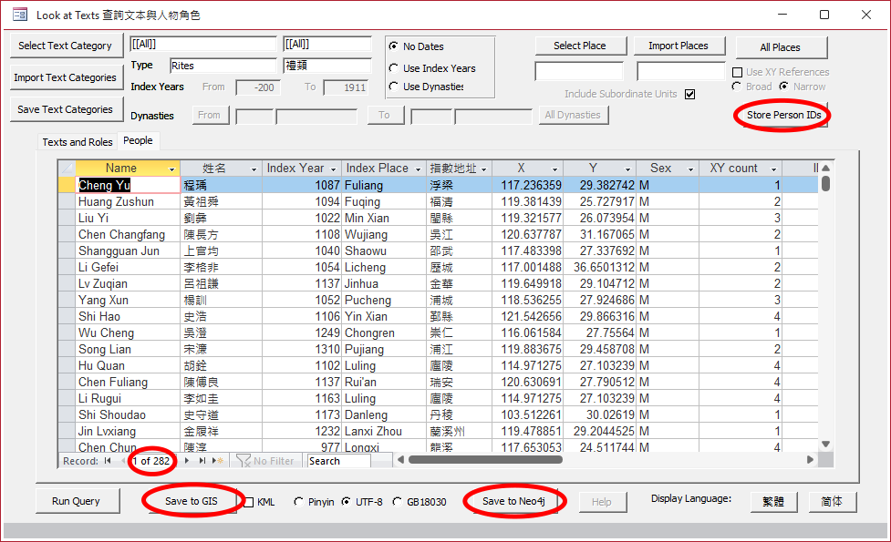

One first selects a category of texts:

In this example, the user selects all the texts in the category of “Rites.” In the simplest query,
one uses just the category without additional filters:
Running the query produces a list of all the role in which people participated in the production
of texts of the selected category for which CBDB has data. There are 517 roles in which 282
people participated in producing texts on the ritual classics in the Confucian canon. In the

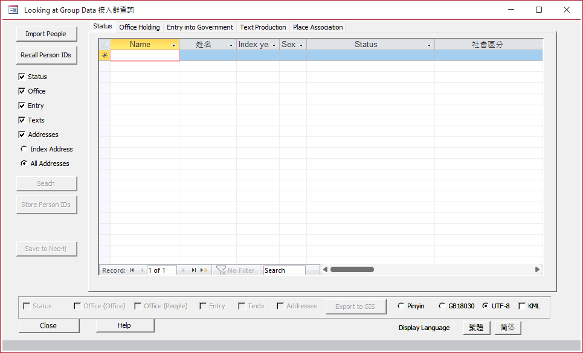

example, Lv Zuqian 呂祖謙 is identified as the author of the San Da li fuzhu三大禮賦注.
The form also provides a list of all the people who participated in these roles:

These people can be stored for further analysis using other forms by clicking on the Store
Person IDs button and can be saved to a GIS file to look at their geospatial distribution with
the Save to GIS button.
Output to a set of Neo4j files by clicking on Save to Neo4j gives one a way to further

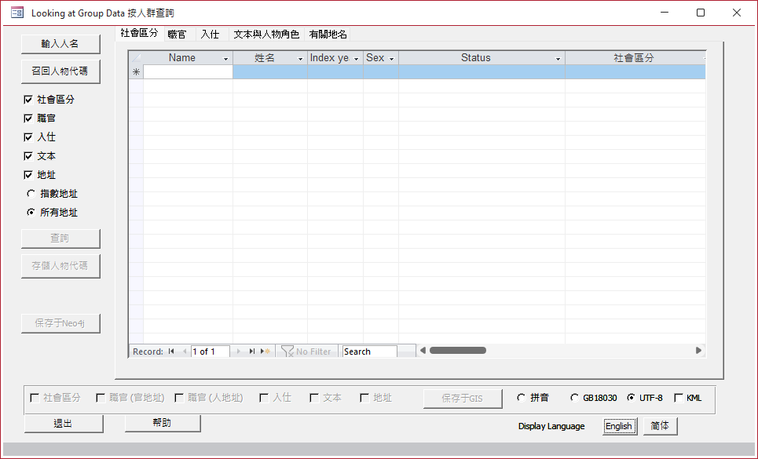

explore the bipartite relationship between people and texts using Neo4j.

### L. Using the form “Looking up Data on a Group of People”

As shown in the description of the other forms, CBDB allows the user to identify groups of
people according to specified characteristics. The form LookAtGroupData allows the user
then to quickly get additional data on these groups of people.
Like the other forms, the user can change the labels from English to either traditional or

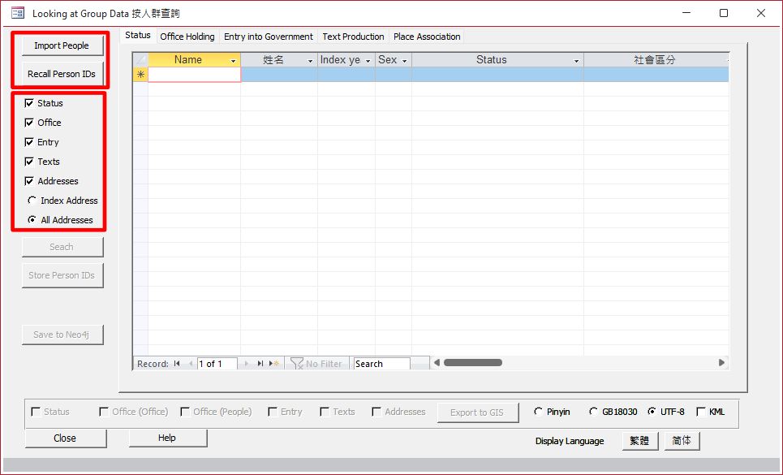

simplified Chinese:
To input the group of IDs to be examined, one can either recall a stored list or import a list from a
file:

Once one has selected the group of IDs, one then selected the types of information to explore.

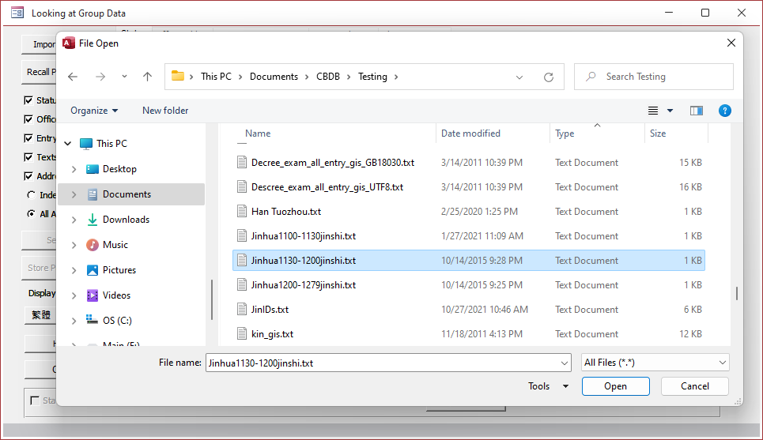

The choices are:
a.status,
b.office holding,
c.mode of entry into government,

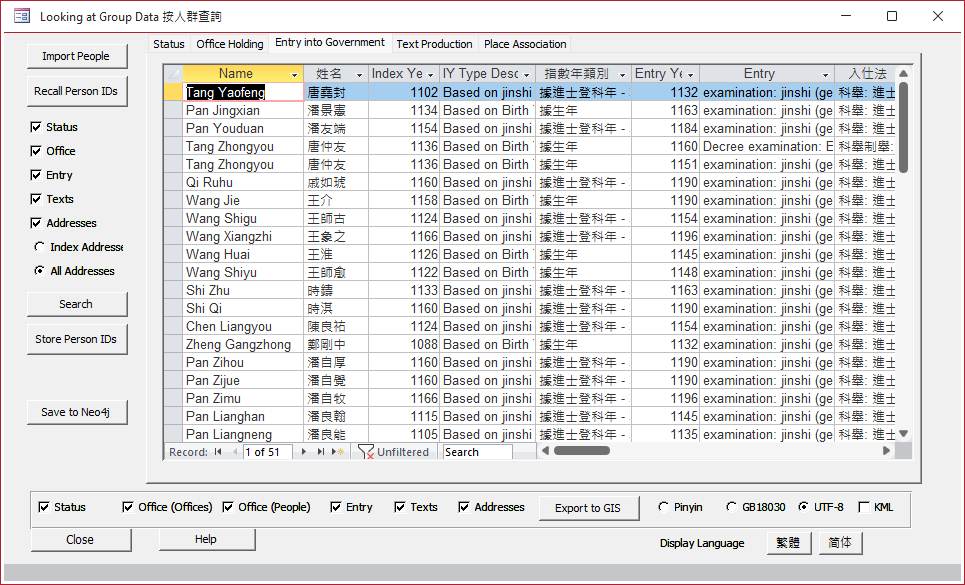

d.textual production, and
e.associations with place (In some cases, one wants to know just the index addresses for the
people in the group, and the form allows the user to select this option.)
One can, for instance, import a list of the people from Jinhua County who earned jinshi
degrees between1130 and 1200:

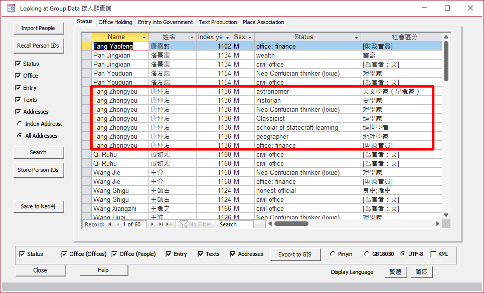

One selects the types of data and clicks the Search button:

The Entry table shows that some jinshi degree holders also used other paths to enter
government service in addition to the jinshi examination. Tang Zhongyou is an example.
The Status table additionally shows the range of forms of social distinction achieved by

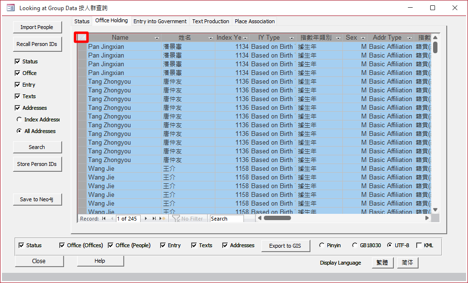

the degree-holders. Tang Zhongyou is, again, a good example:
To save the data from the search, there are three options. One is to select the data in a
table by clicking on the small square in the upper left corner of the table and copying it:

One then can paste the data to Excel or to a text file, etc.

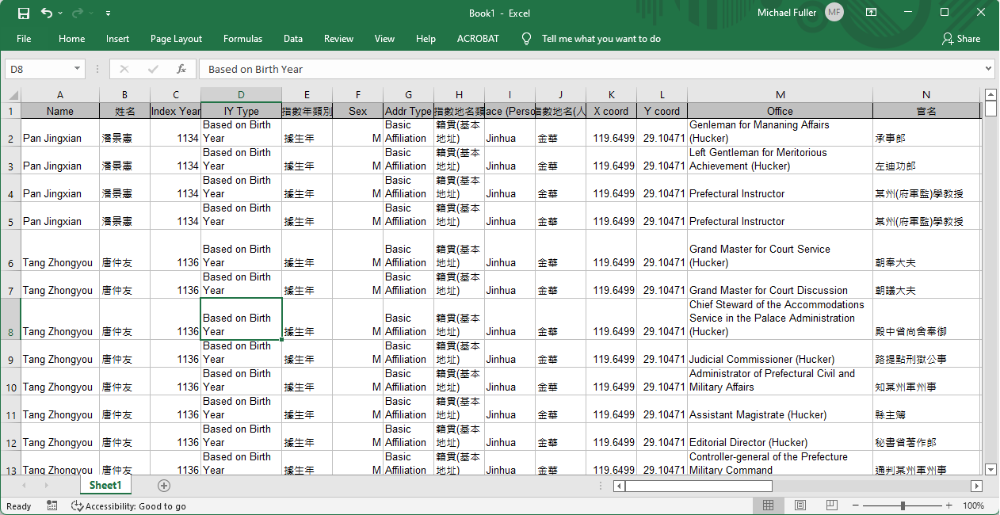

The second way to export the data is to save it to a set of Neo4j files. The number of
files produced by the form depends on the number of categories of information one has
selected for export (see below).
The third way to export the data is to save it to a file that can be opened by GIS
software or to a KML file:

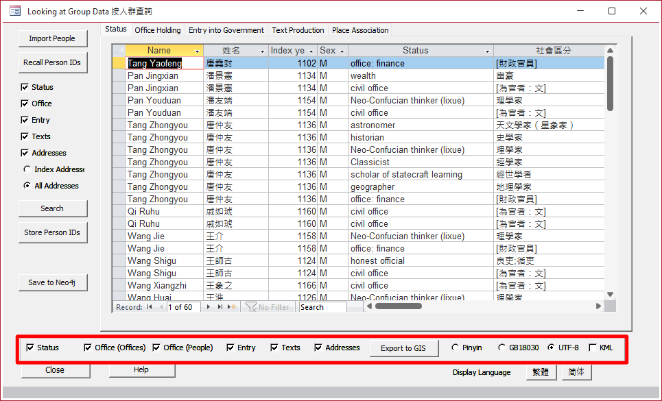

As with exporting to Neo4j, the user selects what type of data to export and the encoding For
GIS, one also chooses the file format. When the user clicks the Export to GIS button, the
form creates a separate file for each type of information.
If the user has imported a list of IDs, this list can be saved by clicking on the Store Person
IDs button.
