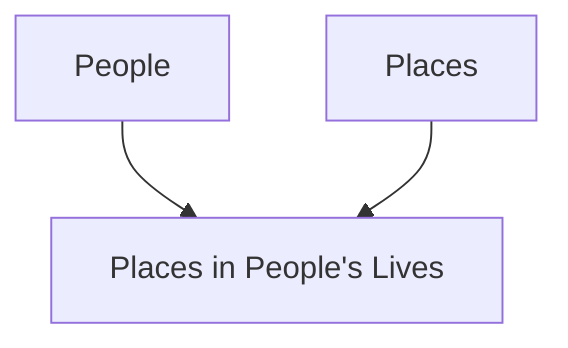

# 第 1 章：關聯式資料庫

## A. 關聯式資料庫與複雜資料的組織 {: #a-rel-db }

關心宋代官員親屬與社會網絡的社會史學者 Robert Hartwell（1932-1996），最早提出以關聯式資料庫研究集體傳記的構想，CBDB 便是在他的初始模型上逐步發展而來。

Hartwell 的關鍵洞見是：若要完成這個研究計畫，必須有一個強而有力的組織工具。他想觀察人物之間、親屬群體、社會網絡、所任官職，以及所關聯地點之間的關係。這個清單很長，而這些元素彼此互動後會快速變得複雜且難以追蹤。Hartwell 意識到，傳記資料中的互動可以理解為 (1) 人、(2) 地方、(3) 官僚體系、(4) 親屬結構、(5) 當代社會交往模式之間的關係。他建立關聯式資料庫，正是為了把傳記資料表述成這五類「事物」之間的關係。在目前由其模型延伸出的 CBDB 版本中，我們又加入三個個體自我界定的社會經驗面向：(6) 寺院、書院等社會機構、(7) 取得社會區辨的文化體系、(8) 龐大的文本生產網絡。

這種把「實體」（亦即世界中的事物類別）之間關係加以結構化的作法，就是關聯式資料庫的核心：它讓我們可以記錄並處理複雜對象彼此之間多樣的互動關係。也就是說，PLACE 是一種實體；在此類別下，我們可以列出所有我們掌握資訊且關注的地點。相同地，PEOPLE 也是另一種實體；在此之下，我們列出所有有傳記資料的人。接著，我們就能列出所有人物與地點之間值得記錄的互動：出生地、遷居地、葬地等等。於是可得到實體關係的抽象模型：

這個抽象模型一旦轉成關聯式資料庫，就會成為一系列由欄位組成、填入資料的資料表：

**PEOPLE**

| ID | Name                     | Dates        |
|----|--------------------------|-------------|
| 1  | Lü Benzhong 吕本中       | 1084–1145   |
| 2  | An Dun 安惇              | 1042–1101   |
| 3  | Chao Buzhi 晁补之        | 1053–1110   |
| 4  | Chen Jian (5) 陈荐       | fl. 1069    |

**PEOPLE PLACES**

| Person ID | Place ID | Relation Type ID |
|-----------|----------|------------------|
| 1         | 1        | 1                |
| 1         | 3        | 2                |
| 1         | 2        | 3                |

**PLACES**

| ID | Place Name        |
|----|------------------|
| 1  | Jinhua 金华      |
| 2  | Shouzhou 寿州    |
| 3  | Kaifeng 开封     |

**PEOPLE-PLACE TYPES**

| Relation Type ID | Relation Type       |
|------------------|--------------------|
| 1                | Basic Affiliation  |
| 2                | Moved to           |
| 3                | Ancestral address  |

請注意，在這種資料表配置下，人物數量、地點數量，以及人地關係類型數量都沒有上限。

由此例可見，在關聯式資料庫中有三種基本資料表：

1. 描述基礎「實體」的資料表。（上方黃色表格：`People` 與 `Places`）在 CBDB 中，這包含人物、地點、親屬關係詞、官僚結構等。這些表格的欄位記錄我們希望掌握的實體屬性。人物包括姓名、生卒年、性別等；地點（CBDB 術語稱為「addresses」）則包括地名、行政層級（縣、州府等）、設置時間等。

2. 描述基礎實體間「關係」的資料表。（藍色 `People-Places` 表）在 CBDB 中，這些資料表把人物與其社會、物理與文化環境的互動轉為結構化格式。其欄位用來記錄描述該關係時被視為重要的特徵。舉例而言，人物接受某官職任命時，除了「人是誰、官職是什麼」之外，通常還會希望知道：(1) 任所在哪裡、(2) 是否實際到任、(3) 到任時間。另一方面，其他實體彼此間也有重要且常常複雜的關係。例如 PLACE 會有上下級行政單位與其有效時間；OFFICE 的關鍵關係之一，則是該官職在特定時點下位於行政層級中的哪個位置。

3. 描述實體間「關係類型」的資料表。（粉紅色 `People-Place types` 表）有時兩類事物在現實中互動方式很多，我們需要更精確記錄互動細節。以上例而言，人物與地點的關係可能很多：可能是法定籍貫、實際居住地，或埋葬地等。將這些關係整理為類別，能讓資料更有結構。

## B. 關聯式資料庫的資料結構規則 {: #b-structuring }

在資料庫設計中，我們通常會盡量讓同一筆資料只被記錄一次。以上例來說，Lü Benzhong 呂本中的姓名在 CBDB 只出現在一筆基本紀錄裡，也就是 PEOPLE 實體對應的主表（該表名為 `BIOG_MAIN`）。凡是與呂本中相關的其他紀錄，都透過他的 ID 連結。如此一來，若我把洪适（正確拼音應為 Hong Kuo）誤寫成 Hong Shi（因誤把第二字當成簡體「适」）時，只需改一處即可。這個「一筆資料，一個位置」原則稱為正規化（normalization）。CBDB 有時會為提升處理速度而暫時違反此原則，但若你要在自己的 CBDB 版本中新增資料表，我們強烈建議維持資料庫正規化。

在前述「人物與地點」例子中，我們會遇到「一人可遷居多地」這件事，也就是「一對多」（one-to-many）關係。若硬要在單一橫列縱欄的簡單表格表示，做法通常有兩種：在人物主表新增多個欄位（如 `Moved to 1`、`Moved to 2`），或把所有資訊塞進同一欄位。前者無法保證欄位數永遠足夠，且主表每筆紀錄都會多出大量空白欄；後者則會使查詢與資料擷取變得困難。正因這兩種方式都有缺點，資料庫設計才有一項通則：當基礎實體之間（此處即 PEOPLE 與 PLACES）出現一對多關係時，應建立獨立的關係類別（如 PEOPLE-PLACES）與對應資料表，以妥善記錄互動。

另一種情況是像《近思錄》這類由朱熹與呂祖謙共同編纂的書。文本與人物屬於「多對多」（many-to-many）關係：一本書可能有多位作者／編者，而每位作者也可能寫過多本書。在 CBDB（以及許多資料庫）中，我們會把這種情況拆成兩組一對多關係，即 PEOPLE 與 WRITINGS，並引入新的關係類別（及對應資料表）PEOPLE-WRITINGS 來記錄資料。

這三項規則很重要：資料正規化、為一對多關係建立新資料表、將多對多轉化為一對多處理。若你想為 CBDB 新增資料類型，請務必掌握。

## C. 關聯式資料庫與複雜資料的互動關係 {: #c-interactions }

CBDB 的核心是在建模人物與各種塑造其社會世界的實體（「事物」）之間的互動。有些實體容易理解其「物性」：地點是具體空間實體，而官僚制度在中國前近代社會中也具有明確結構。親屬關係則較抽象一些。人類學早已指出，社會中的親屬關係是一種結構化系統：某些親屬連結特別強，社會運作亦常圍繞這些連結展開。換言之，人與人不只是單純相關，他們的關係是該社會親屬系統的一部分，並透過此系統獲得意義。把「社會關係」視為一種「事物」會更抽象，但原理相同：若要與他人建立社會連結，社會本身會規範何種關係適切且重要、何種則否。在一個社會所重視的交往系統中，「社會資本」可衡量個體在這張關係網中的定位。CBDB 對親屬與社會關係所建立的分類，正反映我們在前近代中國人物資訊中觀察到、且具有區辨意義的關係系統。作為關聯式資料庫，CBDB 因而能讓使用者探究群體人物生命中這些實體之間的互動。以下是以 PEOPLE 為基礎實體時的實體與關係示意：

雖然 KINSHIP 與 OFFICE 之間沒有直接連線，我們仍可透過人物資料間接探究兩者關係。例如可問：「醫官職位是否具世襲傾向？也就是醫官是否常是醫官之子姪？醫官家族是否彼此通婚？」又或者：中階武官中，轉任文職者是否更傾向迎娶文官之女？

(TODO: Add Chart)
**查詢 OFFICE 與 KINSHIP 的關係**

關於 OFFICE 與 KINSHIP 的關係，我們可以提出非常多問題。例如：高階文官與低階官員在「同階層內通婚」上是否有不同模式？這些群體是否透過婚姻聯盟形成不同社會層級？這些模式是否會隨時間變化？

我們也可對 PLACE 與 SOCIAL RELATIONS 提出類似問題。以四川人為例：他們是主要建立地方性關係，還是建立跨帝國網絡？這些模式在北宋前期到後期、以及北宋後期到南宋後期之間，是否有所改變？

(TODO: Add Chart)
**查詢 PLACE 與 SOCIAL RELATIONS 的關係**

最後，我們也可觀察多重因素互動，例如 PLACE 在 KINSHIP 與 OFFICE 關係中扮演何種角色：

(TODO: Add Chart)
**查詢 PLACE 在 KINSHIP-OFFICE 關係中的作用**

例如：福建出身官員是否比浙江出身官員更傾向形成在地親屬網絡？不同官階的情況是否有差異？這些模式是否會隨時間改變？

在關聯式資料庫中，對 CBDB 實體互動提出問題的真正限制，主要只在於使用者對資料庫與其資料結構的理解程度。
